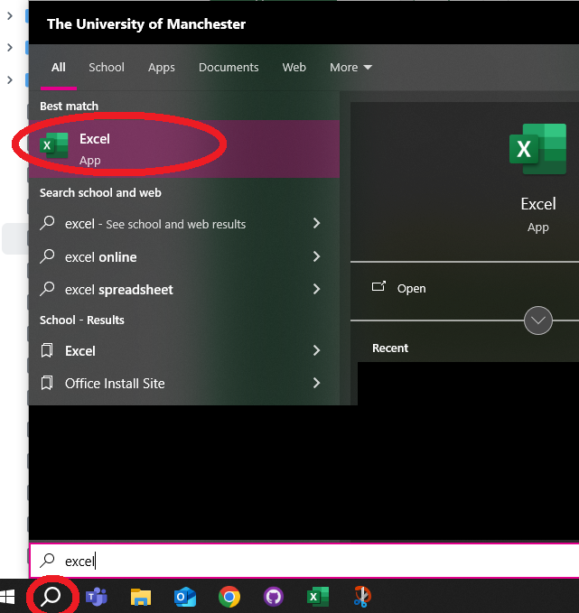

# Week 1 {#week1}

## Learning outcomes

Welcome to week 1! This week is all about getting set up, and taking some first steps in learning about what is *data*. These are the building blocks of all the weeks to come, so pay special attention, and do set a pattern of asking questions! Now, without further ado, let's get started. 


## Familiarising yourself with the course

If you haven’t already, please watch the videos on Blackboard that explain the course setup. It's essential to understand how the six elements (Preparation materials, Lecture videos, Lab session, Homework task, Homework quiz, Feedback session) interconnect. We also strongly recommend reading the Week 1 Introduction to gain further context on the course objectives for this week. You can watch the videos after this session and before tackling the homework and quiz. In the future, make it a habit to go through Blackboard materials first, as they will prepare you for the lab sessions. If you have any questions, ask now or post on the **Discussion board** on Blackboard. 


## Asking a question on the discussion board

For almost all of the questions you will have throughout this module, you will be asked to post them on the discussion board. This is because if you have a question, there are very good odds that others in your class also have the same question. If you ask on the discussion board, we can keep track of all the questions there and build a FAQ of sorts. Then, if someone else has the same question, they might come to the discussion board and see that a similar question has already been asked and, in fact, answered. In this case, you get an instant answer to your query! Very useful! 

If you feel like you don't have any questions, we still encourage you to check the discussion board occasionally to see what others are asking. Maybe there is some interesting discussion you hadn't thought of. Maybe someone asked a question that you know the answer to. In such a case, feel free to answer - don't worry we are monitoring the discussion board, so if your answer isn't quite right, we can follow up. So there is no risk, only the reward of having helped your colleagues :) 


### Activity 1: Posting on the discussion board

All of you should go find where is the [discussion board on Blackboard](https://online.manchester.ac.uk/webapps/blackboard/content/launchLink.jsp?course_id=_82193_1&tool_id=_119_1&tool_type=TOOL&mode=cpview&mode=reset).

Here, you will see a forum titled "week 1 discussion". Click on this, and then click on "Create a Thread". For the subject put **“Activity 1: NAME”** where you replace **NAME** with your name and surname, and write a message to us. What to put in the message? Write a recommendation for us: a book to read, a TV show to watch, or a recipe for us to try and cook. When you are finished, click "Submit". 


## Setting up your working environment


The first thing you need to do is to create a working environment for yourself for this course and for all projects you will work on using data. Just because everything is on your computer or laptop does not mean this is something you can ignore. 


There is a myth about the scientist and the messy workspace, typically illustrated with a picture of Albert Einstein: 

```{r, echo=FALSE}
knitr::include_graphics("imgs/einstein_desk.jpg") 
```


However, many of us need order to be able to work properly. An organised workspace is also prominent, as we can see with the famous workspaces of: Galileo, Marie Curie, John Dalton, Alan Turing, and Charles Dickens:

```{r, echo=FALSE, fig.height=100}
knitr::include_graphics("imgs/galileo_desk.jpg") 
knitr::include_graphics("imgs/marie_curie.jpg") 
knitr::include_graphics("imgs/Dalton_John_desk.jpg") 
knitr::include_graphics("imgs/alan_turing_desk.jpg") 


```

```{r, echo=FALSE, fig.height=100, fig.cap="\\label{fig:figs}Galileo, Marie Curie, John Dalton, Alan Turing, and Charles Dickens all had tidy workspaces"}
knitr::include_graphics("imgs/charles_dickens_desk.jpg") 


```


When working with data, you have to consider your workspace. You can think of your computer folders as your desk. It helps immensely to keep our data, code and notes organised. 


There are as many approaches as people. Some people save everything to their Desktop. I strongly recommend that if you do this, you stop now! 


I recommend going through [this resource from the University of Cambridge data management guide](https://www.data.cam.ac.uk/data-management-guide/organising-your-data) to consider Naming and Organising Files, Documentation and Metadata, Managing References, and Organising E-mail. 


Some key points you might find relevant: 

- **Use folders** - group files within folders so information on a particular topic is located in one place.
- **Adhere to existing procedures** - if you already have a system in place that works for you, just follow that. 
- **Name folders appropriately** - name folders after the areas of work to which they relate. Think of informative and descriptive names - your future self will thank you when trying to locate old notes, data, and files. 
- **Be consistent** – when developing a naming scheme for your folders, it is important that once you have decided on a method, you stick to it. If you can, try to agree on a naming scheme from the outset of your research project.
- **Structure folders hierarchically** - start with a limited number of folders for the broader topics, and then create more specific folders within these.
- **Backup** – ensure that your files, whether they are on your local drive or a network drive, are backed up. You have some options for backup using the university infrastructure, specifically your [P drive](https://pdrives.manchester.ac.uk/horde/login.php) - you can save items there. Or you might use an external hard drive backup. You might also use something like [Dropbox](https://www.dropbox.com/home) or [OneDrive](https://onedrive.live.com/about/en-gb/signin/). No matter what, **BACK UP YOUR WORK**! There is nothing worse than when a laptop crashes irrecoverably or gets stolen, and you've lost everything you've been working on. Trust me, this is a really important thing to consider!


### Activity 2: Create a folder for this module

In your preferred location, create a folder where you will save all your data, materials, notes, and Excel files for this module. You can also create subfolders in these if you like, or you can create these later. Discuss your preferred data management structure with your peer students, taking the key points from the [Cambridge data management guide](https://www.data.cam.ac.uk/data-management-guide/organising-your-data) into consideration. 


#### Note for students using the Computer Cluster on campus. 

If you use computer cluster PCs, there is some extra information you need to know, so please read on. 


**NOTE: If you are using your own laptop/home computer, then you do not need to read this; you can skip to the section 'Getting to know Excel'**


OK, so if you are using a cluster PC on campus, you need to make sure that everything you are working on is saved in your [**P:drive**](https://pdrives.manchester.ac.uk/horde/login.php). 


All students and staff have a personal file storage space on the University network - known as the **P: drive** as this is usually the network drive letter allocated to it. Wherever you log on to the campus network, your P: drive is available (in PC Clusters, the **My Documents** icon on the desktop is a shortcut to the P: drive).


You should already have a **username** and **password** with which to log on. Your username has 7 or 8 letters/digits, typically beginning 'm...'. On the computers in the Faculty clusters (where you work during class time), you will see the Faculty computer 'image' and a version of the operating system Windows 7.


Away from the campus, you can download and upload files to and from your P: drive over an Internet connection - for example, to and from your home computer. You can access the files on your P-drive from anywhere using the link [https://pdrives.manchester.ac.uk/horde/login.php](https://pdrives.manchester.ac.uk/horde/login.php).


  
To create a new folder within your P: drive, click on the 'Create new folder' icon, as shown in the dialogue box below.


 
 
For this specific module, you might want to label the new folder **'CRIM20441'**. You will now have a series of folders in your p: drive (some of these you haven't created yourself; they have been provided for you by the University), one of which you can store course material in. 
Finally, name your Word document 'Trial Document' (in the filename box) and click 'Save'. As noted above, you can remotely access your p: drive (from home or elsewhere). You can do this by logging into your personalised University portal (https://my.manchester.ac.uk).
</span> 


A word of caution - if your P: drive is full (and this tends to happen when you save image or sound files to it), there is a chance that some of the applications you want to use do not work. So make sure you keep your P: drive tidy if you don’t want to run into problems.


One last note for using cluster PCs: because cluster PCs come pre-installed with Excel, you can skip section 1.6.1 and go straight to "1.6.2 Install data analysis toolpak".


 

## Working directory

If you are using your own laptop, you can create and save your files anywhere. However, if you are on the cluster PC you should always save your files on your P:drive. OK - then what?


It's generally good to create a folder to save your data and outputs in, which we will call a **working directory**. So firstly, before we begin to do any work, we should create our **working directory**. This is simply a folder where you will save all our files. You can create a new folder where you will save everything for this course, or you can choose an existing folder. It's advised that you create a folder and also give it some name you remember that will be meaningful. Generally, try to avoid spaces and special characters in folder (and file) names. [Here is a handy guide you should read about naming files and folders that will be relevant for all your future work](http://www2.stat.duke.edu/~rcs46/lectures_2015/01-markdown-git/slides/naming-slides/naming-slides.pdf). 


## Getting to know Excel


The main tool we'll use throughout the course is [Microsoft Excel](https://en.wikipedia.org/wiki/Microsoft_Excel). You will be using it to explore, learn about, and manipulate criminological data throughout this course. 


### Install Excel

Through the University of Manchester IT Services website, all taught students have access to Office Suite, which includes Microsoft Excel. This means you can download Microsoft Excel **for free**, courtesy of the UoM Library. [Follow the instructions here to get Microsoft Office on your laptops](http://www.itservices.manchester.ac.uk/students/office365/). 


You likely have come across Excel before, but it is also possible that you have not, so I will start with the assumption that this is your first time opening it up. Exciting. So, let's get to it.


First, find where you've installed Excel on your own machine. If you have a Mac, it will be in your "Applications" folder:


If you have a PC, use the search option on the taskbar and look for Excel:





When Excel opens, you usually see an empty spreadsheet. We will be using this just a little bit later. But for now, there is one more step we need to take to be fully set up. **We need to install the data analysis toolpak.**


### Install data analysis toolpak


To install data analysis toolpak, click on the 'File' tab, and click on 'Options':


This will bring up a pop-up window. Here, click on 'Add-Ins', and then highlight 'Analysis Toolpak'. Click on 'Go':


This will open another pop-up window. Here, make sure you tick the box next to 'Analysis Toolpak', and click 'OK':


Click 'OK' and you should be done! You can check by clicking on the 'Data' tab and checking to see if a little **Data Analysis** icon has appeared: 


If you are confused, see [here](https://support.office.com/en-gb/article/Load-the-Analysis-ToolPak-6a63e598-cd6d-42e3-9317-6b40ba1a66b4) for instructions on how to get this. You can find the instructions for Mac [here](https://support.microsoft.com/en-us/office/load-the-analysis-toolpak-in-excel-6a63e598-cd6d-42e3-9317-6b40ba1a66b4#OfficeVersion=macOS). Once you have successfully installed the data analysis toolpak, it will appear.  

And that's it - you are now set up! Excellent! 

You can now move on to the substantive part of today's course. In the next section, we will learn about variables and data.


## Data: Variables and observations

```{r, echo=FALSE, warning=FALSE, message=FALSE}
library(tidyverse) 
library(lubridate)

gmp_crimes <- read.csv("https://www.dropbox.com/s/8tkpjwsmtqeddr9/gmp_crimes.csv?dl=1")
#gmp_crimes <- read.csv("C:/Users/josep/OneDrive/Manchester/Making Sense/MSCD_labs/gmp_crimes.csv") #Jo made local path use above if you have good wifi

topCrimTyp <- gmp_crimes %>%
  group_by(Crime.type) %>%
  summarise(n=n()) %>%
  arrange(-n)


```


We know that in the period from May 2016 to May 2017, Greater Manchester Police recorded a total of `r I(nrow(gmp_crimes))` crimes. We also know that the largest numbers were recorded in the "`r I(head(topCrimTyp$Crime.type, n=1))`" crime category, with  `r I(head(topCrimTyp$n, n=1))` instances. The fewest number of incidents was recorded for the "`r I(tail(topCrimTyp$Crime.type, n=1))`" category, with `r I(tail(topCrimTyp$n, n=1))` instances.


We can also track changes in the number of crimes over time:


```{r, echo=FALSE}
gmp_crimes %>%
  group_by(Month) %>%
  summarise(n=n()) %>%
  arrange(-n) %>%
  ggplot(., aes(x = Month, y = n, group=1)) +
  geom_line() +
  ylim(c(20000,40000)) +
  theme_bw() + 
  theme(axis.text.x = element_text(angle = 90, hjust = 1))
  

```


How do we do this? Well, in the United Kingdom, since 2011 data regarding individual police recorded crimes have been made openly available to the public via the [www.police.uk/](https://www.police.uk/) website. This means that by visiting the [data.police.uk](https://data.police.uk/) website, you can access data about street-level crime, outcome, and stop and search information, broken down by police forces. What does this mean? What do these data look like? Let's have a look:


```{r, echo=FALSE}
gmp_crimes %>%
  select(-Crime.ID) %>%
  head(n=3) %>%
  knitr::kable() 
  
```


In this dataset, each row is one crime record:


For every single crime event recorded in this data, there is a row, and it contains all the information that we know about this crime incident. It will have a value for each variable that we are interested in. The variables are the columns. 


So, for example, *month* is a variable in our data, and for every row (which is every crime incident), this variable can take a value. Every crime incident occurred at one specific month, and that month when each incident happened will be the value that the *month* variable will take. And the month column will contain all the instances of the month variable for each crime incident recorded. Each observation (crime) will have a value for this variable (the month when it was recorded).


Let's have a go at recording some data observations and putting them into a database to give you some hands-on experience here. If you're interested in the open data from police.uk, do read [this paper here about it.](http://www.tandfonline.com/doi/abs/10.1080/15230406.2014.972456). You can also read about some problems Greater Manchester Police has faced when recording crime data in these two news: (a) "[Greater Manchester Police 'failed to record 80,000 crimes in a year'](https://www.bbc.co.uk/news/uk-england-manchester-55251366)", (b) "[Greater Manchester’s £27m crime recording system ‘doesn’t work’, says police chief](https://www.theguardian.com/uk-news/2021/jun/29/greater-manchesters-27m-recording-system-doesnt-work-says-police-chief)".


### Activity 3: Building your own data


<!--Often, you will have data readily created for you, such as we saw with the police.uk data set, which can be downloaded in the rectangle format, where your columns are your variables, and your rows are your observations. But data can take many forms. So we will have a go at dealing with some data that comes in a very unruly form: tweets!-->


<span style="color:#d95f02"> You will better understand how data represents what you are measuring if you have a go at building your own dataset. We will do this here by using data from [X (formerly known as Twitter)](https://twitter.com/home) (you will need to log in). You are most likely familiar with Twitter. You probably even tweet yourself. But even if you have never used Twitter (recently renamed as "X"), you will no doubt know someone who does. In fact, many police forces use Twitter. Greater Manchester Police (GMP) is one of these forces, and in particular, GMP City Centre likes to keep its followers updated. Recently, the Manchester Evening News had an article based on following GMP City Centre's tweets for one Saturday night. [You can read about that here](http://www.manchestereveningnews.co.uk/news/greater-manchester-news/what-police-city-centre-deal-13441129). 


Evidently, tweets present really exciting and rich data. However, they do not come in a readily available format for analysis in the form we just presented here. But what you can do is collect data from tweets. And this is your task for your first lab activity.


We have collected for you a set of tweets. Your task is to turn this into a rectangular data format, with the columns as variables and the rows as observations (tweets). Let's go through how to do this step-by-step.


But first things first, we need a tool. As discussed, we'll mainly be using Excel in this course. So, open up Excel and create a brand new spreadsheet. 


Your first activity is to create a column header for each variable we want to collect. The easiest way to do this is just to make the first row your column headers. You can go ahead and create a column for each of the variables we are interested in collecting about each tweet. These are: 

- **Month**: The month in which the tweet was sent.
- **Day**: The day of the month in which the tweet was sent.
- **Hour**: The hour when the tweet was sent, in 24h format (where 13:00 is 1pm and 01:00 is 1am).
- **Account**: The account who tweeted this tweet.
- **Tweet**: The content of the tweet itself.
- **Likes**: Number of likes for this tweet.
- **Retweets**: Number of times this tweet was retweeted.
- **Comments**: Number of comments made as reply to this tweet.


Now, you will just have to create a new row for each tweet and populate a value for each variable we collect in our data. We will go through the first tweet with you so we're clear on what's happening. 
This is tweet number 1: 

- [ Tweet 1 ](https://twitter.com/GMPCityCentre/status/891900693585506304) 

You will see this open in a new window. Now, let's try to find the value for each variable in this tweet: 


- *Month*: July
- *Day*: 31
- *Hour*: 06
- *Account*: GMPCityCentre
- *Tweet*: Man left £1000 Stella McCartney bag on seat in Village bar with person he had just met, and when returned, woman and his bag had gone
- *Likes*: 43
- *Retweets*: 15
- *Comments*: 15


When you enter these values, your data will look like this: 


Make sure that you are copying (keyboard shortcut: ctrl + C/ command + C) and pasting (keyboard shortcut: ctrl + V/ command + V) the 'Tweet' variable, rather than typing it out yourself, to save time and also ensure accuracy. 


> **NOTE:** It is possible that you see a slightly different time, number of retweets, comments, etc. than what I have here. This could be because you are logged into your own Twitter account, and [Twitter shows you the time in your own time zone](http://www.adweek.com/digital/tweet-timestamps/). Don't worry about this for the purpose of this exercise, just type what time, retweets, comments, etc., you see, even if it's different to the results here. 

OK, ready? Then, let's build our data by adding the following tweets as additional rows: 

- [Tweet 2](https://twitter.com/GMPCityCentre/status/891762454337867776)
- [Tweet 3](https://twitter.com/GMPCityCentre/status/894515606321590273)
- [Tweet 4](https://twitter.com/GMPCityCentre/status/894024570109386752)
- [Tweet 5](https://twitter.com/GMPCityCentre/status/891247668772708352)
- [Tweet 6](https://twitter.com/GMPCityCentre/status/891254643078176768)
<!-- - [Tweet 7](https://twitter.com/GMPCityCentre/status/890871354924421120) -->
<!-- - [Tweet 8](https://twitter.com/GMPCityCentre/status/890594946536927233) -->
<!-- - [Tweet 9](https://twitter.com/GMPCityCentre/status/890161961626996736) -->
<!-- - [Tweet 10](https://twitter.com/GMPCityCentre/status/889084990495051776) -->


Once you have entered all these, you should have a pretty solid set of tweets looking something like this:


While entering your data, you probably noticed variations in when the tweets were made, how many likes and retweets they received, and possibly also started interpreting the tweet's meaning. Some of them disseminate stats, for example, about the number of arrests or share information about an operation. Some appeal for information. And some are just one-off cases presented to the public. 


But now, you turned the unstructured data of tweets into a structured dataset, where your observations (tweets) are the rows and the variables you're interested in (month, day, hour, account, tweet, likes, retweets, comments) are all columns.


Once you are done, save your data. You can do this by clicking on *"file"* and then *"save as"* and navigating to your working directory to save your file. You can save it as a *comma separated value* file, or '.csv'. Next term you will be dealing with data in this format. This way any formatting that you do to the spreadsheet (e.g., making the column titles bold, etc.) will *not* be preserved. However, your data will be available to read by more advanced software that we will use in the next term, not just Excel. It doesn't hugely matter at this stage how you save your data. 


In any case, if you follow these steps, you will have a saved set of data in a *.csv* file, hopefully with some meaningful name: 


And now, you have created your first dataset. Your columns are your variables, which correspond to *Month*, *Day*, *Hour*, *Account*, *Tweet*, *Likes*, *Retweets* and *Comments*. Your rows are the tweets from which you have collected this information. 
 
 
## Questions about your data


Why would we do this? Well, turning information into data allows us to ask questions and draw meaningful conclusions. For example, by looking at your newly created dataset of tweets, you can easily answer the question below: 


- *Which tweet has the highest number of likes?*


### Activity 4: Thinking about what our data tells us


Take a moment to look at your data to answer this question (*Which tweet has the highest number of likes?*). Which one is it? Read the content, have a think, and discuss with your peers why you think that this particular tweet has the highest number of likes, given your data. Now, try to come up with an alternative explanation. I would like you to now talk about your two possible explanations for why this tweet has the highest number of likes. Write these on your shared notes. 


## Looking at real data


The above exercise gave you an idea about how observations (in that case, tweets) can be turned into datasets where each row is one observation, and each column is one variable. 


We demonstrated this above with the *police.uk* data, which is some real data that is released about crime statistics and something that you can see and download yourself. 


We can play around with police-recorded crime data, which can be downloaded from the [www.data.police.uk/](https://data.police.uk/) website. 

We can download some data for crime in London. 

To do this, open the [https://data.police.uk/data/](https://data.police.uk/data/) website. 

- In `Date range` select a range you want to look at. We selected December 2023 - December 2023, but you can choose something more recent if you like.
- In `Force`, find `Metropolitan Police Service`, and tick the box next to it. 
- In `Data sets` tick `Include crime data`.
- Finally, click on the `Generate File` button.

This will take you to a download page, where you have to click the `Download now` button. This will open a dialogue to save a *'.zip'* file. Navigate to the working directory folder you created before and save it there. Navigate to the folder again and unzip the file by either double-clicking it, or by using right-clicking, and then click on "extract". Then, open the file in Excel (by double-clicking it).  If you're stuck, here is a guide on how to do it: 

- [Unzip a file on Mac](https://www.dummies.com/computers/macs/how-to-zip-and-unzip-files-on-your-mac/)
- [Unzip a file on Windows](https://support.microsoft.com/en-us/help/4028088/windows-10-zip-and-unzip-files)

 
 
You should be looking at one month's worth of crime data from the Metropolitan Police Service. Isn't that exciting? Real data at your fingertips! 
 

## Code books


To understand what the variables (columns) in our data mean, we usually look for resources that can tell us about this. A reference guide that tells you what the variables mean is usually called a **code book**, which is essential for both quantitative and qualitative datasets.

Creating data is a gift that keeps on giving, not just for yourself but for others as well. Data collected by researchers is often shared and made available for others to use as well, so that they can explore their own research questions. For example, the [UK Data Service](https://www.ukdataservice.ac.uk/) is a large repository of data where you can sign up and access secondary data to analyse (both quantitative and qualitative). You may have heard of the [Crime Survey for England and Wales](http://www.crimesurvey.co.uk/) or the [Smoking, Drinking and Drug Use among Young People Survey](https://tinyurl.com/bdddmy7a). The data collected by these surveys are online. Many many variables collected about individuals, neighbourhoods, and other units of analysis (to be returned to later) are available to us. Isn't that really cool!? If you want to know what thousands of people replied to the question asking them what the most important issue was to them when they voted in an election, you can find out just by downloading the correct dataset!

Some more fantastic examples of qualitative and quantitative datasets can be found on the [Sage Research Methods website](https://methods.sagepub.com/Search/Results?contentTypes=Datasets&disciplines=[3]).

But there is one important consideration when sharing a dataset, and something that is **very important** to you if you are using a dataset someone else has created - you need to know what the variables *mean*. This is made possible by the creation of something called a *codebook* (sometimes called a *data dictionary*). This is a note that accompanies a dataset, telling the user a bit about the data, including what each variable means. 

For example, in England and Wales, we have a national victimisation survey, the Crime Survey for England and Wales (CSEW), which asks people about their experiences with victimisation, their worry about crime, their trust in the police, and other criminal justice-related topics. We will be using this dataset later in the course. For you to be able to make sense of these data when you download it, they come with some information, including the codebook. 

For example following this link you can find the user guidance for the 2013-14 wave, specifically the teaching data set (unrestricted access): [http://doc.ukdataservice.ac.uk/doc/8011/mrdoc/pdf/8011_user_guide_csew_2013-14_teaching_dataset.pdf](http://doc.ukdataservice.ac.uk/doc/8011/mrdoc/pdf/8011_user_guide_csew_2013-14_teaching_dataset.pdf)

If you go down to page 6, you will see a list of variables in the CSEW 2013-2014 in a table, which has the variable name and then its description. Further down from page 7, you will see the *'Codebook'* that tells you more information about each variable. You see, there is quite a bit of information provided, including the variable name, the question that was asked, a label (which is a short description of the variable), and the possible values the variable can take. 


For example, if you scroll down a little bit, you can find the variable `homealon` (page 12), which is the variable that contains people's responses to the question *How safe do you feel when alone in home at night?*. You can see it can take up one of the following values: 'Very safe' (coded as 1), 'Fairly safe' (coded as 2), 'A bit unsafe' (coded as 3), 'Very unsafe' (coded as 4) or 'Don't know' (coded as 9). These are the possible answers that people could have given. 


If we were to share our tweet dataset, we would have to create something similar to this for that as well. Something like this, perhaps: 


```{r, echo=FALSE}

df <- data.frame(Variable = c(
  "Month", "Day", "Hour", "Account", "Tweet", "Likes", "Retweets", "Comments"), 
  Description = c("The month in which the tweet was sent", 
                  "The day of the month in which the tweet was sent", 
                  "The hour when the tweet was sent", 
                  "The account that sent the tweet", 
                  "The tweet text", 
                  "Number of likes", 
                  "Number of retweets", 
                  "Number of replies to the tweet")
  )

df %>%
  knitr::kable()


```


Is there anything else that you would include? Why or why not? Have a think, and if you want to, discuss it with a friend. The important thing here is that you understand what a *codebook* (or *data dictionary*) is, and that if you come across a dataset, always make sure to look for the associated *codebook*/ *data dictionary* to be able to understand what each variable means. If you download your data from the web, you will usually find a link to the data dictionary on the site where you downloaded the data from. 


Similarly, access to anonymised crime data through [www.police.uk](https://www.police.uk), which you just downloaded, allows us to ask questions about levels of crime in our local area and use these data to answer them. Access to this data allows us to study crime trends across the UK. It allows us to answer questions - such as, which crime category had the highest number of recorded crimes in the last year? Or is the volume of crime increasing, decreasing, or staying the same? 


To answer these questions, we need **data**. The data you can see above on crimes that fall under GMP between May 2016 and May 2017 can be used to measure crime during this time period in this area. You can access the data dictionary for these data on the police.uk site at [https://data.police.uk/about/#columns](https://data.police.uk/about/#columns). 


It is important to always seek out a data dictionary when using data to know what the variables represent. And if you are making your own dataset, then to create a data dictionary to let others (and even your future self) know what your dataset is all about. 


## Levels of measurement


> The word data is the plural of the Latin datum, meaning a given, or that which we take for granted and use as the basis of our calculations. This meaning is carried in the French word for statistical data, données. We ordinarily think of data as derived from measurements from a machine, survey, census, test, rating, or questionnaire — most frequently numerical. In a more general sense, however, data are symbolic representations of observations or thoughts about the world. As we have seen, we do not need to begin with numerals to create a graphic. Text strings, symbols, shapes, pictures, graphs themselves, can all be graphed. 

- Leland Wilkinson (2005) *The Grammar of Graphics*


As Leland Wilkinson points out, data can be numeric, but it can be other things as well. Data could be text, such as the tweets seen above. It can also be a date, which is a special kind of number, because it has some meaning. Pictures can also be data, as can video or audio. You can also have spatial or geographic data, perhaps in the form of the coordinates for where a particular crime event took place. These are all possible types of data, and we could collect them as variables or columns in our dataset. In the tweets, we collected the text of the tweet, as well as the text of the account and the month, as well as some numbers, such as number of likes, retweets, etc. So we know that a variable is *something that varies*, that you can note about an observation. It's really important to spot what *type* of variables you are using. When we talk about kinds of variables, we begin to talk about **levels of measurement**.


We can speak about the **level of measurement** of a variable, which refers to whether that variable belongs to the category of *nominal*, *ordinal* or *numeric*. Let's explore what these categories mean.


If we set out to collect our own data, we need to make sure that we collect all the variables needed to answer our question, from all the observations that we have. The types of variables we have determine the kinds of questions that we can answer. For example, if we want to ask questions such as the one about the tweets above: "*Which tweet has the highest number of likes?*", we need to have a **numeric** variable. **Numeric** variables let us answer questions about *quantity*. For example, if we want to know the *average number of crimes per month*, we will need a numeric variable of the number of crimes for each month. Just like for the tweets, we had a numeric variable of the *number of likes* for each tweet. Put simply, number questions are answered by **numeric** variables. 


You can always refer back to the lecture video, on blackboard, about levels of measurement here if you like!


### Activity 5: Levels of measurement pt. 1


Have a look back at the tweet dataset you created. Now tell me: **Which variables are numeric?**


Discuss this with a friend, and agree on which variables you think are numeric. Do you find it easy to agree on your choices? Once you agree, write your answer down and scroll down to reveal if you were correct!


...

...

...

...

...ready?
 


OK, here's your answer:


So, is this the same as you thought? If yes, nice work! 


If you did not get this right, was that because you also selected the **day** and the **hour** variables? If it was, then that is perfect, because that is what we were secretly hoping you would do! But that's not quite correct.


Why are day and hour **not** numeric variables? After all, they *are* numbers, right? Well, a simple way to think about that is - does it make sense to calculate the average hour in which tweets were sent? If I told you the average hour for GMP tweets is 13.5, is that something meaningful? Or if I told you that the average day is 15? Not hugely. Hour of the day and day of the month, which is what these variables represent, are variables which fall into a different level of measurement. These are **ordinal** variables. What does that mean? Well, the clue is in the name, **ordinal** variables that are not numeric, but they do fall into a *natural order*. 

*Natural order?* What's that? Well, natural order just means that there is a meaningful order in which you can put these variables. You know which comes after which one. For example, you can consider letters of the alphabet to follow a natural order, so common we call it alphabetical order. If I tell you to arrange medium, large, small, you know that what we mean is to put them in this order: small, medium, large. **Ordinal variables** are variables where such a known order exists. 


### Activity 6: Levels of measurement pt. 2


So, now you know that hour in the day and day in the month are *ordinal* variables. There are many more, such as attitudes towards something (*'Strongly agree'*, *'agree'*, *'neutral'*, *'disagree'*, *'strongly disagree'*) or worry about crime as measured in the CSEW (*'Very worried'*, *'fairly worried'*, *'not very worried'*, *'not at all worried'*). There is also one more ordinal variable in our Twitter data set - can you find the other ordinal variables in your tweet dataset? Again, take some time to think about this.


...

...

...

...

...ready?
 

The other ordinal variable is *Month*. You know that if I say January, February, March, then the value to follow is April, and not November. There is an *order* that these values fall, making *Month* an **ordinal** variable. 


What about the others? *Account* and *Tweet*? These are **nominal** variables. These are sometimes also referred to as *qualitative variables*. But you can still carry out quantitative analysis on them. You will very often see **nominal** variables in quantitative analysis. In this case, the *Account* variable tells you who is tweeting, and if you have tweets from many different accounts, for example, if we also looked at \@gmptraffic and \@GMPMcrAirport, we could compare tweets between them. These variables are **nominal** and **not** ordinal because they do not fall into any particular order. You can arrange them in any order, and it would look just as legitimate as any other order. For example, if I say January, February, September, May, August ... you immediately look and see that it is not in its natural order. However, if I say \@gmptraffic, \@GMPMcrAirport, \@GMPCityCentre or \@GMPMcrAirport, \@GMPCityCentre, \@gmptraffic, you don't feel a need to reorder one way or the other. **Nominal** variables have no natural order.


Is it starting to make sense? To recap, each variable can fall into measurement levels, and these are **numeric**, **ordinal** or **nominal**. By the way, **ordinal** and **nominal** are also called **categorical** variables because they assign each observation into a *category*. Then, depending on whether the category values can be put in a meaningful order or not, you can tell if it's an *ordinal-categorical* or *nominal-categorical* variable. 


Confused? Let's look at this again, but with the crimes data. 


Let's glance at the crimes dataset first:


```{r, echo=FALSE}
gmp_crimes %>%
  select(-Crime.ID) %>%
  head(n=3) %>%
  knitr::kable() 
  
```


There is one variable there that is called **Crime.type**. This variable can take a value that corresponds to one of the crime types listed in the Police.UK FAQ page: [https://www.police.uk/pu/about-police.uk-crime-data/](https://www.police.uk/pu/about-police.uk-crime-data/) - under the tab *'what do the crime categories mean'*. For every recorded crime incident, an officer will have to classify the incident into one of these categories. All of these categories are all the possible **values** that the *Crime.type* **variable** can take. This is a **categorical** variable, as its possible values are categories. Moreover, this is a **nominal** variable because the categories do not fall into a natural order. These categories are mutually exclusive (a crime is classed as either a *Burglary* or *Vehicle Crime*, but not both at the same time) and cannot be ordered in a meaningful way (alphabetical is not meaningful!). If they did have a meaningful order (for example, days of the week have an order, or the values *small, medium, large* have an order), they would be **ordinal** variables. Both ordinal and nominal variables are categorical because they deal with values that can take a finite number of values or, in other words, belong to a set number of categories. They group your data into one of the available categories. 


In the coming weeks, we will discuss about creating frequency tables, where you group your data by categories, and create a new dataset, where you have the group and the number of observations in each group. For example, we can look at the **numeric** variable of  *number of burglaries*. Suppose we have created this dataset, which has 2 variables, one *Borough* variable with the name of each borough, and one *Number of burglaries* variable, with... you guessed it... the number of burglaries in that borough. 


It would look something like this: 


```{r, echo=FALSE}
#create variable for boroughs in lazy way
gmp_crimes$borough <- substr(as.character(gmp_crimes$LSOA.name), 1, nchar(as.character(gmp_crimes$LSOA.name))-5)

gmp_crimes %>%
  filter(Crime.type=="Burglary") %>%
  group_by(borough) %>%
  summarise(number.of.burglaries = n()) %>%
  arrange(-number.of.burglaries)%>%
  filter(number.of.burglaries > 10) %>%
  knitr::kable()

```


This dataset is made up of 10 **observations** and 2 **variables**. You might notice that this maps nicely onto 10 rows of 2 columns. As noted in the previous section, the columns represent your **variables**. The rows represent your **observations**. Your observations (or rows) are every single record in your data. So, in the case above, every borough has one observation, or the number of crimes in each area. For each observation, we record 2 variables. One variable is the name of the borough. This variable is called *borough*. The other variable is the number of burglaries that took place in that borough. It is called *number.of.burglaries*, and it is a **numeric** variable. 


**Numeric** variables can also be assigned into subgroups. **Interval** variables have values of equal intervals that mean something. For example, if you have results from an IQ score, the difference of 1 score between 90 and 91 is the same as 91 to 92. But there is no *true* zero value, and it doesn't make sense to say someone is twice as smart as someone else. **Ratio** variables, however, have an absolute zero (a point where none of the quality being measured exists), and using a ratio scale permits comparisons such as being twice as high or one-half as much. This can get somewhat confusing, and there are sometimes people who argue that a particular type of variable belongs to one group or the other. For example, if you have a Likert scale of *'Strongly agree'*, '*Agree'*, *'Neutral'*, *'Disagree'* and *'Strongly disagree'*, you can say that this is an ordinal variable (categories that have a natural order). But you could also translate them into numbers, saying it measures agreement from a scale of 1 (*'Strongly disagree'*) to 5 ('*Strongly agree'*). In this case, it is possible to treat this as an interval scale variable. The truth is, you can choose either option, **but you have to have some good justification why**. Did someone else do this before you? Did you read a recent paper where one method was argued to be better than the other? In some instances, it will always be clear what type of variable you have. But you should always take time to consider what the level of measurement of your variable is, and what that means for what you can say about your data. As a personal preference, we advise against treating ordinal data as numeric, but others will advise that it's generally OK to take means and apply statistical tests to ordinal data - just be careful about making interval claims such as "twice as satisfied." You can read more about it [here](https://www.theanalysisfactor.com/pros-and-cons-of-treating-ordinal-variables-as-nominal-or-continuous/).


> See reading: Chapter 2 Statistics in Criminal Justice - David Weisburd, Chester Britt for interval/ratio, or for discrete/continuous)


The reason we need to know what type of variable we are dealing with is because this will determine the kinds of analyses we can do to it, further down the line. For example, next week we will talk about summarising data. As discussed above, for a *numeric* variable, we can take the average, and use this to summarise it, whereas for a *categorical* variable, you can't. Think about it if someone asked you, "What is the average gender in the class?" This doesn't make sense. Instead, you would look at proportions. Gender is a *categorical* variable. However, if someone asked you what is the average age in the class, you could easily answer it because age is a *numeric* variable. 


Here are some more examples of each:

- Categorical-Nominal variables: 
    + Gender: Male, Female, Other.
    + Hair Color: Brown, Black, Blonde, Red, Other.
    + Type of living accommodation: House, Apartment, Trailer, Other.
    + Religious preference: Buddhist, Mormon, Muslim, Jewish, Christian, Other.

- Categorical-Ordinal variables: 
    + Socioeconomic status: poor, middle class, rich.
    + Anything measured on a Likert Scale (e.g., Level of Agreement): strongly disagree, disagree, neutral, agree, strongly agree
    + Time of Day: dawn, morning, noon, afternoon, evening, night.

- Numeric-Interval variables:
    + Celsius Temperature.
    + Fahrenheit Temperature.
    + IQ (intelligence scale).
    + SAT scores.

- Numeric-Ratio variables:
    + Bank account balance.
    + Age in years.
    + Height in cm.
    + Number of children in a class. 


Now, before we move on to the exercise, have another dose of these concepts through the power of video. Remember when the teacher put on a video to watch in school? That was the best. Here, we will do this too, to keep the nostalgia alive. 


Start with this quick one: - [Levels of measurement summary here](https://www.youtube.com/watch?v=hZxnzfnt5v8) 6.19min


and then continue by watching Chris Wilde describe them: 


- [Data Organisation ](https://www.youtube.com/watch?v=_ROBwTFVldo&list=PL8CRAVedURQpYNoFt7w6maxaQCn3ZLytu&index=3) 5.18min
- [Categorical variables ](https://www.youtube.com/watch?v=38oQwFeCEag&list=PL8CRAVedURQrlxeFfme0TEgaj1_h67JUR&index=2) 4.58min
- [Ordering categories ](https://www.youtube.com/watch?v=xmRuRRHsUeg&index=3&list=PL8CRAVedURQrlxeFfme0TEgaj1_h67JUR) 2.27min
- [Numeric variables ](https://www.youtube.com/watch?v=U3lk2nQYfAQ&list=PL8CRAVedURQrlxeFfme0TEgaj1_h67JUR&index=4) 5.52min


Great, by now, you are an expert on levels of measurement. 


## Unit of analysis


We've been speaking about our variables (*columns*) a lot, but let's also not forget to discuss the importance and meaning of our observations (*rows*). We know by now that each row is an observation. In the original data set about crimes, every single crime incident represents one row. Here are 3 crimes:


```{r, echo=FALSE}
gmp_crimes %>%
  select(-Crime.ID) %>%
  tail(n=3) %>%
  knitr::kable() 
  
```


But we also saw above a case where we were looking at the number of crimes per borough. In that case, there were only 10 rows because there are 10 boroughs, and we only had one observation per borough. Here is that dataset again: 


```{r, echo=FALSE}
gmp_crimes %>%
  filter(Crime.type=="Burglary") %>%
  group_by(borough) %>%
  summarise(number.of.burglaries = n()) %>%
  arrange(-number.of.burglaries)%>%
  filter(number.of.burglaries > 10) %>%
  knitr::kable()

```


What is the significance of this? 


The *unit of analysis* is the major entity that is being analyzed in a study. It is the *what* or *who* that is being studied. Your unit of analysis will depend on the questions that you are going to be asking. You will always want your rows to represent your unit of analysis so that you can collect data *about* these in the variables and you can answer your questions. 


Take this example:


We want to see whether boroughs with higher population counts have higher numbers of crimes. To be able to explore this question, we need information about the number of crimes and the number of population in each __________. 


...

...

... 

borough!


What about this one: 


We want to see whether men consume more illegal drugs than women. To be able to explore this, we need information about the gender and the drug consumption of each _________. 


... 

... 

... 

... 

person! (or individual, or subject)


Are you seeing the pattern? If you are comparing things, whether that's population and crime or gender and drug consumption, you are comparing this between *things*. You are comparing population and crime rates between *boroughs*, and you are comparing gender and drug consumption between *people*. These are your **units of analysis**. 


### Activity 7: *Abstract*-ing the unit of analysis


Let's do an exercise. This is similar to the ones in the lecture video. 


Read this abstract of an academic article: 


> Over the last 40 years, the question of how crime varies across places has gotten greater attention. At the same time, as data and computing power have increased, the definition of a ‘place’ has shifted farther down the geographic cone of resolution. This has led many researchers to consider places as small as single addresses, group of addresses, face blocks or street blocks. Both cross-sectional and longitudinal studies of the spatial distribution of crime have consistently found crime is strongly concentrated at a small group of ‘micro’ places. Recent longitudinal studies have also revealed crime concentration across micro places is relatively stable over time. A major question that has not been answered in prior research is the degree of block to block variability at this local ‘micro’ level for all crime. To answer this question, we examine both temporal and spatial variation in crime across street blocks in the city of Seattle Washington. This is accomplished by applying trajectory analysis to establish groups of places that follow similar crime trajectories over 16 years. Then, using quantitative spatial statistics, we establish whether streets having the same temporal trajectory are collocated spatially or whether there is street to street variation in the temporal patterns of crime. In a surprising number of cases we find that individual street segments have trajectories which are unrelated to their immediately adjacent streets. This finding of heterogeneity suggests it may be particularly important to examine crime trends at very local geographic levels. At a policy level, our research reinforces the importance of initiatives like ‘hot spots policing’ which address specific streets within relatively small areas.


- [Is it Important to Examine Crime Trends at a Local “Micro” Level?: A Longitudinal Analysis of Street to Street Variability in Crime Trajectories](https://link.springer.com/article/10.1007/s10940-009-9081-y)


What is the unit of analysis here? Take a moment to discuss with a friend what you think the unit of analysis is, and more importantly, why you think this! Then come to an agreement and note it down. 


What did you decide on? The helpful thing here is to look at what is the question they are asking - and what are they asking this about? The key sentence here is this one: *"... we examine both temporal and spatial variation in crime across street blocks in the city of Seattle"* You can see that they are talking about *crime* (measured as *number of arrests*) per each *street block* or *street segment*. So your unit of analysis is *street segments* or *street blocks*. 


Want to play again?


Try this one: 


> This paper examines the importance of neighbourhood context in explaining violence in London. Exploring in a new context Sampson’s work on the relationship between interdependent spatial patterns of concentrated disadvantage and crime, we assess whether collective efficacy (i.e. shared expectations about norms, values and goals, as well as the ability of members of the community to realize these goals) mediates the potential impact on violence of neighbourhood deprivation, residential stability and population heterogeneity. Reporting findings from a dataset based on face-to-face interviews with 60,000 individuals living in 4,700 London neighbourhoods, we find that collective efficacy is negatively related to police-recorded violence. But, unlike previous research, we find that collective efficacy does not mediate the statistical relationship between structural characteristics of the neighbourhood and violence. After finding that collective efficacy is unrelated to an alternative measure of neighbourhood violence, we discuss limitations and possible explanations for our results, before setting out plans for further research.

-[Collective Efficacy, Deprivation and Violence in London](https://academic.oup.com/bjc/article-abstract/53/6/1050/418215)


Once again, take some time to discuss it with friends, and then note down your agreed answer. Once you have, scroll down for the solution!

...

...

...

...


This one is a bit tricky. You can see they talk about how they collected data in the sentence *"Reporting findings from a dataset based on face-to-face interviews with 60,000 individuals living in 4,700 London neighbourhoods..."*. But remember, we want to look at the questions they were asking - and you can see they are talking about **neighbourhood violence**. You can see this because they talk about looking into the *"statistical relationship between structural characteristics of the neighbourhood and violence"*. Their unit of analysis is *neighbourhoods*. 


Of course, you could have also cheated and read the paper. The unit of analysis will not always be obvious from the paper abstract. Unless, of course, you come across a helpful abstract like this one: 


> Objectives: To test the generalizability of previous crime and place trajectory analysis research on a different geographic location, Vancouver BC, and using alternative methods.
Methods: A longitudinal analysis of a 16-year data set **using the street segment as the unit of analysis**. We use both the group-based trajectory model and a non-parametric cluster analysis technique termed k-means that does not require the same degree of assumptions as the group-based trajectory model.
Results: The majority of street blocks in Vancouver evidence stable crime trends with a minority that reveal decreasing crime trends. The use of the k-means has a significant impact on the results of the analysis through a reduction in the number of classes, but the qualitative results are similar.
Conclusions: The qualitative results of previous crime and place trajectory analyses are confirmed. Though the different trajectory analysis methods generate similar results, the non-parametric k-means model does significantly change the results. As such, any data set that does not satisfy the assumptions of the group-based trajectory model should use an alternative such as k-means.

-[Crime and Place: A Longitudinal Examination of Street Segment Patterns in Vancouver, BC](https://link.springer.com/article/10.1007/s10940-014-9228-3)


But the most important thing here is that you understand what is meant by **unit of analysis**. It is not always the level at which your data is collected. For example, we have the crime data from [police.uk](police.uk), where each row is one measurement. This is called **individual level** unit of analysis. But we can still use that to talk about the number of crimes in boroughs. But for us to be able to do that, we need to convert that into a table where each row is the borough; we need to aggregate up and just count the number of crimes in each one. Therefore this is an **aggregate level** unit of analysis. 


Have a watch of this quick video [here](https://www.youtube.com/watch?v=XHXTR8jeEUg) for some more examples and explanations. 


## Summary


In sum, you should now be more familiar with data than when you started. And you should be comfortable with the following terms: 

- working directory
- data
- codebook/ data dictionary
- variable
- observation
- levels of measurement
  + nominal, ordinal, numeric
- unit of analysis

From your readings, you should also be comfortable with the following: 

- reliability
- validity
- the difference between descriptive statistics and inferential statistics


