# Week 6 {#week6}

## Learning outcomes

Welcome to the first of two qualitative data analysis computer lab sessions. Today we will learn about the software package [NVivo](https://www.qsrinternational.com/nvivo-qualitative-data-analysis-software/home) and how you can use this to analyse and manage your qualitative data (and literature).

In this session you’ll learn:

- Why we use computer aided qualitative data analysis software ([CAQDAS](https://en.wikipedia.org/wiki/Computer-assisted_qualitative_data_analysis_software)) to manage and interrogate qualitative data, and more importantly, how to do it!
- Some basic but fundamental processes for importing your data into the software and learning how to organise your files.
- How to run some preliminary analysis in preparation for the real, heavy duty thought work next week.

## What is qualitative data analysis?

If we want to know what is qualitative data analysis, first we need to understand what we mean by *qualitative data*. Qualitative data is pretty much any type of data that is not numbers. 

In previous sessions we saw how to analyse information recorded in quantitative variables, which as you already know can take different levels of measurement (categorical or numeric). But in reality there is a lot of information out there which is not quantified. In other words, there is a lot of information which is not quantitative. And we can also use this information for research! 

Thus, *qualitative data* refers to any type of non-numeric information, which can include interview transcripts, written notes, video and audio recordings, images and other types of text documents. We will learn here that we can extract meaningful information from those - and use it in our research.

Qualitative data isn't just text-based data, and it can also include non-quantitative information included in images (e.g., whether a person is smiling, whether it reflects a happy or sad environment), audio recordings (e.g., whether the person talking had a particular accent, or if we can hear some background noise), etc.

### How’s qualitative data different from quantitative data?

To begin with, while quantitative data focuses on numbers or *quantities*, qualitative data is more about meanings, descriptions, concepts or ideas. One may even say that qualitative data is about the "soft side" of things, focusing on the implicit and explicit meanings of non-quantified information, while quantitative data is more about differences and relationships between information which has been previously quantified.

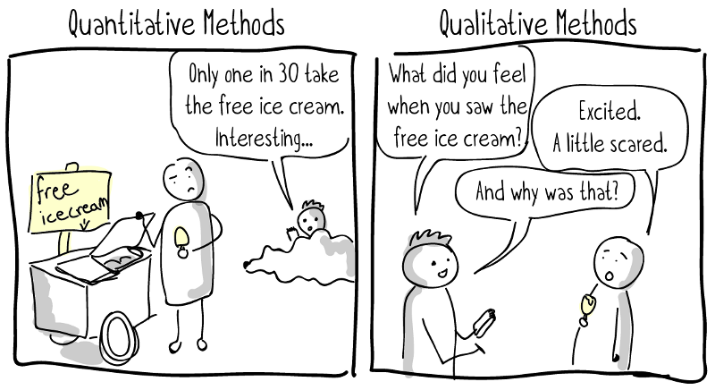

Let's give a very simple example. We may be interested in studying pub brawls between football fans. We can record *quantitative data* about the number of fights, teams of supporters involved, place where they occur, time when they take place, if those involved required hospitalisation, and even if the police showed up to stop the fight. All those variables can be quantified. However, we may also be interested in the "words" used by those involved in the brawl before, during and after the fight, as well as their body language and facial expressions. And we can even talk to them and ask them about their rationale for becoming involved in the fight, how they feel and what it means to them. This sort of information is usually recorded in *qualitative data*.

### Activity 1: Exploring the FinCEN files

We can see another example of the difference between *qualitative* and *quantitative* data using real-world crime data.

In September 2020, the [International Consortium of Investigative Journalists](https://www.icij.org/) (ICIJ) published information about 2,657 leaked documents, including 2,121 [suspicious activity reports](https://en.wikipedia.org/wiki/Suspicious_activity_report) (SARs) from the U.S. Treasury's [Financial Crimes Enforcement Network](https://en.wikipedia.org/wiki/Financial_Crimes_Enforcement_Network) (FinCEN). In total, those suspicious activity reports covered over 200,000 suspicious financial transactions between 1999 and 2017 valued at over 2 *trillion* US dollars, and they involved multiple global financial institutions. These files are knows as the [FinCEN leaked files](https://en.wikipedia.org/wiki/FinCEN_Files).

The suspicious activity reports were generated by financial institutions in more than 170 countries, and refereed to financial transactions that played a role in facilitating money laundering and other fraudulent crimes. The *FinCEN files* became highly controversial soon after being published, showing that the US Treasury had intelligence about many suspicious activity reports but did little to stop such crimes. You can learn more about the FinCEN files [here](https://www.youtube.com/watch?v=ZAp1wOsOEDE).

We have uploaded a dataset with the main variables of the *FinCEN files* on Blackboard. You can download it from **"Data for labs and homework" -> "FinCEN files" -> "fincen_transactions"**.

You can download this file in *Excel* and explore it using the skills learnt in previous weeks. Can you answer the following questions?

- Which beneficiary bank (variable *'beneficiary_bank'*) received a larger number of suspicious transactions (variable *'number_transactions'*)? How many suspicious transactions did it receive?
- Which beneficiary bank (variable *'beneficiary_bank'*) received a larger amount in dollars from suspicious transactions (variable *'amount_transactions'*)? How much money did it receive?

You can find the correct answers after the gif...

...

...

...

...

The correct answers are:

- *Which beneficiary bank received a larger number of suspicious transactions? How many suspicious transactions did it receive?*
[Credit Suisse AG](https://en.wikipedia.org/wiki/Credit_Suisse). It received 768 suspicious transactions.

-  *Which beneficiary bank received a larger amount in dollars from suspicious transactions? How much money did it receive?*
[Rosbank](https://en.wikipedia.org/wiki/Rosbank). It received 3,559,623,596.60 US dollars from suspicious transactions.

Is this surprising to you? You can have a chat in small groups to discuss these results.

This dataset included many other quantitative variables that you can explore. And while this is highly interesting and allows us to obtain highly valuable information about patterns of suspicious financial transactions, it does not include all information about each suspicious activity report received by the U.S. Treasury. 

In fact, the vast majority of information is recorded as text, describing how each transaction activity happened, who were the main beneficiaries, the evidence that these were linked with different types of serious and organised crime, etc. The majority of the data from these reports in *qualitative data*. And we can analyse it to obtain information also about the potential motivations of offenders, techniques used to cover the criminal intent, etc.

You can download two snapshots of two different suspicious activity reports from Blackboard (**"Data for labs and homework" -> "FinCEN files" -> "suspicious activity report snapshot 1" and "suspicious activity report snapshot 2"**). Read through them and start thinking how you would use all this qualitative data for research.

In sum, *qualitative data analysis* is about collecting and systematically analysing non-numeric data to understand opinions, motivations, experiences and concepts in a particular context, thus gaining in-depth understanding about a particular problem.

### Is qualitative data analysis easier?

Not quite. Qualitative data analysis can be extremely challenging and time-consuming. Not only we need to spend a lot of time and effort collecting qualitative data by interviewing a set of subjects or observing hours and hours of social interactions, but we also need to systematically code and analyse all this information, and make sense of it based on theory and previous research findings. Differences in meaning can be incredibly subtle and nuanced, so researchers need to put a lot of effort into extracting meaningful interpretations and meanings from qualitative information. Long story short: qualitative data analysis *is not* any easier than any other type of data analysis!

It is key to say, however, that not all qualitative data is *primary data* (data collected by researchers themselves), but qualitative data can also be *secondary data* (when it was already published by someone else). For example, we may want to analyse the content of news articles which were already published online, or we may use analyse open access interview transcripts recorded by other researchers in the past (see some examples about [hate crime victimisation experiences](https://reshare.ukdataservice.ac.uk/851570/) or the [2011 London riots](https://reshare.ukdataservice.ac.uk/853792/)).

### Types of qualitative data analysis

While it is not the purpose of this course that you achieve complete understanding about the different qualitative data analysis methods, we may make a very brief introduction to the main existing approaches.

- **Content analysis**: This refers to the process of coding and categorising qualitative data to extract classifications, summaries and hidden patterns. For example, we may count the number of times a politician speaks about ideas around *"security"* and *"securitisation"* in a political speech, and even observe patterns in his or her body language when doing so.
- **Narrative analysis**: Narrative analysis is about listening to people telling stories, explaining experiences and sharing ideas, and analysing what all of this means. Researchers analyse what respondents say taking into account their contexts and experiences, thus obtaining information about the context-dependent meanings of their discourse. For example, we may interview people in prison and analyse [their justifications](https://en.wikipedia.org/wiki/Techniques_of_neutralization) for being involved in crime, thus obtaining insights into their views of the world and perceptions about the criminal justice system.
- **Discourse analysis**: This is about analysing spoken language or conversation within its social context and culture. Researchers consider the culture where a discourse takes place, and its historical context, to understand the meaning of a given sentence or speech. For example, to understand the meaning of a conversation between a CEO and an employee we first need to be aware of the power dynamics and the organisation culture where it takes place. And to understand the meaning of a letter written in the 17th Century we need to understand the historical background in which it was written.
- **Thematic analysis**: Thematic analysis takes a large body of qualitative data and groups it according to certain similarities - which we call *themes*. These themes help us organise the content of the data and make sense of it to understand its meaning. Thematic analysis is usually exploratory, in that researchers develop the codes of their themes as the analysis of data progresses. For example, we can ask a group of people to talk about their perceptions of the criminal justice system, and identify themes around people focusing on positive experiences with the police, others about racial biases in the prison system, others about stop and search, and so on. 
- **Grounded theory**: The purpose of the grounded theory method is build a new theoretical framework from our data, through a series of "tests". Researchers let the data "speak for itself" and transform its meaning into an explanatory theory. In grounded theory, researcher begin with an overarching question about a given topic of interest (e.g., when do people have fear of crime?). A small sample is then selected and respondents are asked to talk about this topic from their own experiences and perceptions. After analysing the qualitative data emerging from the analysis of thes first cases, some patterns will start to emerge (e.g., people may say narrow alleyways are scary) and you can even create a series of hypotheses. Then you may select another sample, and see whether this pattern holds true also for them. And then repeat the process with new samples. As this process goes on, a new theory may begin to develop.

You can watch [this Youtube video](https://www.youtube.com/watch?v=hECPeKv5tPM) to learn more about qualitative research methods, and how to combine quantitative and qualitative data analysis in mixed methods research.

## Introducing NVivo, a software for qualitative data analysis

In weeks 6 and 7 we will learn how to use a software for qualitative data analysis called **NVivo**.

To give you the corporate spiel: NVivo provides a flexible range of different ways to handle the analysis of qualitative data - good code and retrieve tools with powerful tools for data visualisation and interrogation. A wide range of multimedia and social media data types are acceptable to NVivo.

Essentially, the NVivo Software allows you to analyse and manage a range of qualitative data, from textual data such as interview transcripts or government documents, to videos, pictures and audio files. In these two sessions we’ll focus on textual data mainly, but once you feel comfortable with NVivo you might want to explore all the available functionality.

**Note 1**: Below we describe how to download and install NVivo in your laptops and home computers. For those of you using University computers, the Windows versions of NVivo 11 should be installed and ready for you to use.

**Note 2:** The directions below are for the Mac version of NVivo. The functionality between the two versions is slightly different in some cases, but not drastic, so you should be able to figure it out. But we will give you some indications of where you can find the main functionalities available in NVivo for Windows too.

### Installing NVivo 12

We know some of you are using your own laptops and you may want to install NVivo to follow through the computer lab. If that's the case, you’ll need to download the version 12 of NVivo from their website. You can do this from the QSR website [here](https://www.qsrinternational.com/nvivo-qualitative-data-analysis-software/home).

First, you need to register using your own personal details. To do so, first click on "Sign In":

Press "NVivo Login":

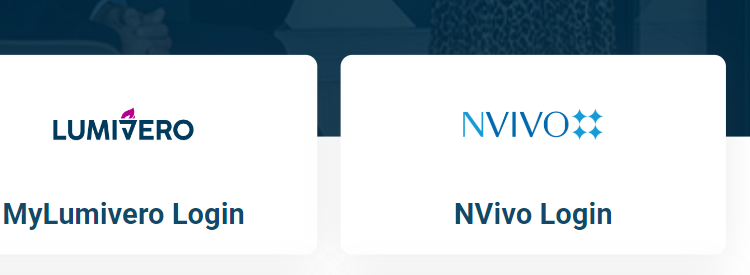

Select 'Register now':

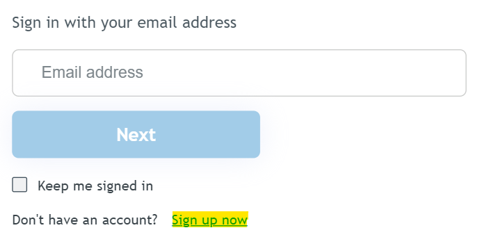

Then fill in your personal details and **your UNIVERSITY EMAIL**. Agree the terms and conditions and privacy policies, and sign up.

As this website updates frequently, we have provided two ways to download the file.

**VERSION 1**
You see a "Downloads" tab in the upper part of the site, click on it and select "Older versions":

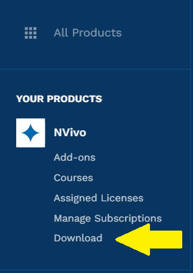

Now find the "NVivo 12 for Windows" or "NVivo 12 for Mac" buttons, and press on it:

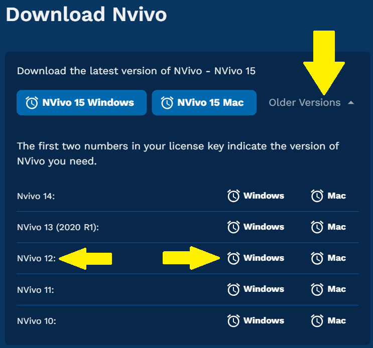

**VERSION 2**

Click [here](https://my.lumivero.com/products/nvivo/download) to go directly to the downloads page. Click on 'Older versions', then select Nvivo Version 12 either for Windows or Mac.

**NEXT STEP**

You will download an executable file in your computer, click on it once it is fully downloaded.

And then you can select your language, accept the terms in the license agreement, and press "Finish".

You’ll need the License code to complete the installation process: **NVT12-IZ000-SHA20-UR685-NNZYI** (code for 2023/2024)

Then you should see a message saying "Your licence has now been activated".

You can now set up your account with your name and initiats, and start using NVivo!

**Note 3:** If you have issues with downloading and installing NVivo from the software website, take a look at the IT Services Software Centre where [guidance on installation can be accessed](https://manchester.saasiteu.com/Modules/SelfService/?NoDefaultProvider=True#knowledgeBase/view/60A01BC1B8C84E6C8C8FE2B3C73B84E4). You can also download NVivo 12 directly from the University of Manchester Electronic Software Delivery System, for Windows [here](https://www.software.itservices.manchester.ac.uk/software/538) and for Mac [here](https://www.software.itservices.manchester.ac.uk/software/538). If you still have issues, you’ll need to contact IT services.

**Note 4**: Please do not forget to read Chapters 1 and 5 of the ["Using Software in Qualitative Research: A Step-By-Step Guide"](https://www.librarysearch.manchester.ac.uk/permalink/44MAN_INST/bofker/alma992976454286501631) book. These are key for you to fully understand how to use software for qualitative data analysis.

The lab sessions will also be strongly supplemented with video tutorials from the QSR website. QSR is the organisation that manages NVivo.

### Activity 2: Watch NVivo tutorials

Discover more about the NVivo tutorials [here](https://help-nv.qsrinternational.com/20/win/Content/tutorials/nvivo-tutorials.htm). Take a look at the website now and watch some of the starter videos. You can choose to watch the Windows or Mac tutorials - whichever suits your needs. If you haven’t watched them already, we would recommend watching the following before you get into the main lab work:

- Watch the three *basic* NVivo 12 video tutorials. It is very important that you watch these. These tutorials will teach you how to:
    + ‘Import Documents’, for [Windows](https://www.youtube.com/watch?v=QN6AAKmZvIo) or [Mac](https://www.youtube.com/watch?v=I7tJpX2ixDI). 
    + ‘Code Your Data’, for [Windows](https://www.youtube.com/watch?v=vVEyhibQGog) or [Mac](https://www.youtube.com/watch?v=J-EZlNTZDrw).
    + ‘Organise and Review Your Nodes’, for [Windows](https://www.youtube.com/watch?v=KEo3nt5GL7Y&t=2s) or [Mac](https://www.youtube.com/watch?v=p5ugfM6caBE).

- For further details, you may also wish to watch the following short videos:
    + How to ‘Import Documents’, for [Windows](https://www.youtube.com/watch?v=NjTIYXTsYSE) or [Mac](https://www.youtube.com/watch?v=TmkqvFXKwo4).
    + How to 'Code Text' for [Windows](https://www.youtube.com/watch?v=7v59gwQ2LUY) or [Mac](https://www.youtube.com/watch?v=nxYT0J6lbDU).
    + How to ‘Create Memos’, for [Windows](https://www.youtube.com/watch?v=Gks-AtrMLlI) or [Mac](https://www.youtube.com/watch?v=_tSQZBZeAUc).
    + How to ‘Create a Word Cloud’, for [Windows](https://www.youtube.com/watch?v=Rx-8eY_z6lQ) or [Mac](https://www.youtube.com/watch?v=mEVyV19D0fY).
    

    
We’ll be talking you through most of the above in the session notes today. If you get stuck at any point, it’s worth re-watching these videos or seeing if there is a video available for your specific query. It’s a useful website.

## What kinds of data can I input into NVivo for analysis?

In brief, and just for your information, you can analyse the following kinds of data in NVivo:

**Text** – NVivo 11 can manage files that are .txt, .rtf, .doc, .docx, and .pdf. It is fine to include embedded charts, tables, graphs, or images. However, in Word files, headers and footers, page numbers, line numbering, comment boxes (as per MSWord) will not be visible once imported.

**PDF format** - where the file has been converted into PDF from Word or similar application, the file can be imported as it is, though some functions- like Text search will not work quite as well as if they were in Word/RTF/plain text. If the PDF document was created (possibly scanned) without optical character recognition it may just be an image style format which can still be imported but the more limited ‘region selection’ mode not ‘text’ mode will be required to apply codes or annotations and text search tools are unlikely to work.

- WE’LL BE DOING SOME IMPORTING OF DOCUMENTS AND PDFs TODAY…

**Datasets** – Import e.g. survey data direct from Excel and other database formats.

**Multimedia** – NVivo 8 onwards recognizes many formats for visual, audio, and audio-visual materials. Most common formats are useable. For video files, the general rule of thumb is that if they will play in Windows Media Player, they will work in NVivo.

**Social media data** (e.g. from Facebook, LinkedIn and Twitter) and Evernotes – can be imported into NVivo. - WE’LL BE DOING THIS NEXT WEEK…

**Ncapture** – an interface between Internet Explorer and NVivo can be used to capture web pages, pre-code them and then import them into a project

### Activity 3: Find some data…

Before we start with NVivo, we’d like you to find some data that you’ll use in the session today. You can use the data that we use, which are available on Blackboard (**"Data for labs and homework" -> "Dankse bank data"**), but we think it’s more interesting for you (and will help you remember the processes better!) if you find some data that reflect your own criminological interests.

For instance, given the major news coverage of [Danske Bank money laundering scandal](https://en.wikipedia.org/wiki/Danske_Bank_money_laundering_scandal), in our example we collected five news stories from different news organisations for the search ‘money laundering Danske Bank’.

But not everyone gets as excited as we do about researching the movement of illicit finances of global individual and corporate elites…

We’ve simply saved each news article in a folder on our desktop:

 
At this point, it’s important to save your web content as PDF files. This will make them easier to import into *NVivo* (we’ll get to this later.) If you’re on a Mac, you can do this by opening the web page, selecting print, then selecting ‘Save as PDF’. Save these in your Media Articles folder. There are different ways you can save as PDF, so stick with what you know.

 

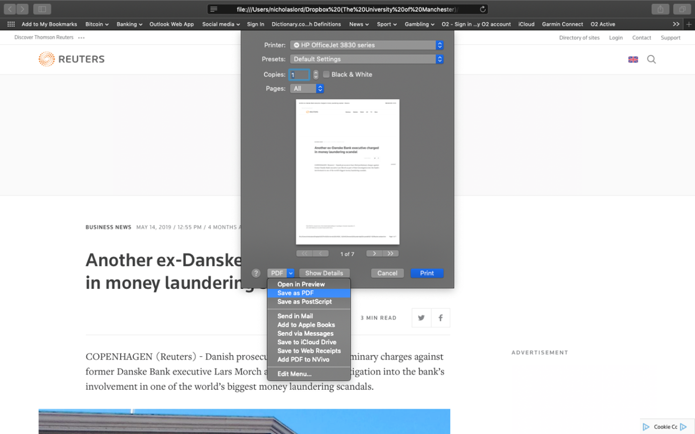

If you are using a PC, these are the steps you need to take to download a news as a pdf:

Do this for each of your media articles.

We then searched for reports and documents on money laundering strategy within the EU. We saved five of these to our documents folder.

We then searched for ‘money laundering criminology’ on [Google Scholar](https://scholar.google.com/) – you could also try the [University’s online databases](https://www.librarysearch.manchester.ac.uk/) (probably a more systematic approach in actual fact) – and selected five relevant academic articles published since 2015.

In order to keep it nice and tidy, we’ve organised our documents into three folders: **‘Media Articles’**, **‘EU Strategy'** and **‘Journal Articles’**.

 
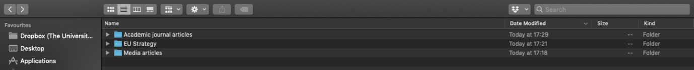

They are now ready for ‘importing’ into NVivo.

So, go and find your own media articles *(x 5)*, academic journal articles *(x 5)* and non-academic official sources *(x 5)*. Save these to your p:Drive or personal laptop in an accessible location.

This is just an example dataset, in a real research project, your literature and data search would need to be much more extensive and systematic, but for the purposes of demonstrating NVivo, it will suffice!

Ok, so now you’ve identified 15 textual data sources and saved them somewhere easily accessible (e.g., in a folder entitled ‘NVivo Session’).

Forget about these for now. We’ll be back.

## Creating your NVivo project

Before we open up our textual data in NVivo, we will need to learn how to create a new project.

### Activity 4: Getting started with NVivo

Let’s get started then. First, you’ll need to open NVivo from your computer. Search for it on your computer. This will open up a folder something like the following in Mac:

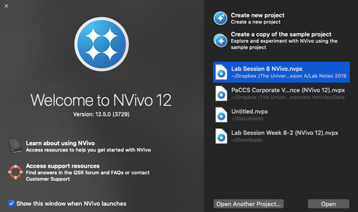

Or PC:

Second, you need to ‘create new project’. So click on the appropriate option. You’ll then need to name and save the project, put it in the same folder as your data:

Click ‘Create’. And we are ready to start our project!

A page like this should open up.

In Mac:

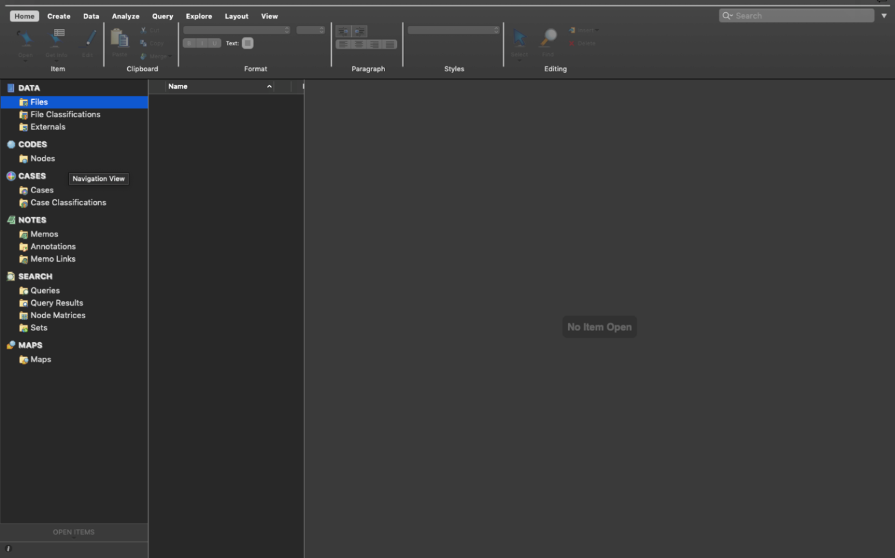

Or in Windows:

 
Everything you do in NVivo saves automatically. However, it’s worthwhile getting into the habit of saving after you do something important, just in case something goes wrong! You can ‘Save’ via the file tab.

So, what can you see in the interface?

## Understanding the NVivo interface

At the top of the screen are the ‘ribbon tabs’. In Mac:

In Windows:

 
Ribbon tabs provide access to varying functions.

Basic ribbon tabs consist of:

- **File**: Saving, Managing etc.
- **Home**: editing functions etc.
- **Create**: making new things
- **Data** (in Windows, this is called **Import**): various import options,
- **Analyse**: Coding, linking, annotating.
- **Query** (in Windows, this is included in **Explore**): range of functions to vary queries and query views and output
- **Explore**: Charting, queries, models
- **Layout** (in Windows, this is called **Home**): manipulating tabular outputs
- **View** (in Windows, this is included in **Home**): altering what you can see, arrangement of windows, coding stripes, etc.

**Note 5**: There are a few aspects of work that are only accessible via the ribbon tabs (for instance some of the editing tools are only accessible from the *Home* Tab, varying Code stripe views is only available from the *View* ribbon tabs, Charts and other visualisations are only accessible via the *Analyse* ribbon tab). But there are many other functions which are accessible more easily from the right button in the List panes. Some ribbon tabs only open up when you are in a particular function, for instance when you are in a Model, a specialized Model ribbon tab appears, but you create a new Model from the Explore Ribbon tab. You’ll figure this out through trial and error.

So, below is the main window of the interface:

You organise all your research materials in the **‘Navigation View’**. The navigation pane (left hand portion of the screen) is the main way of moving around the main functional areas of the software, Sources, Nodes etc. – and getting into the right folder you need in order to see the relevant ‘list’ so that you can open individual items. When you select a function – a set of folders appears in the top half of the pane. Select a folder and the relevant List appears on the right. Double click on an item in the list and the relevant item opens up in the Detail pane below. Successive opened items are tabbed I along the central bar separating the List pane from the Detail pane.

In PC, it may look like this:

## Navigation View

Today you’ll learn about three of the sections in the Navigation View: *Data*, *Nodes* and *Memos*. 

The layout varies slightly between the Mac and Windows software, and also between different versions of NVivo (e.g., NVivo 11, NVivo 12). So keep this in mind when following the below instructions.

### Data

*Data* (called *Sources* in NVivo 11) can be any type of data file or memo, embedded or external to the project.

Data can be text, multimedia and datasets. There are three main folders associated with data. For now, we’ll just focus on the *‘Files’* folder.

### The ‘Files’ section

The *Files* folder (called *Internals* in NVivo 11) is designed to hold all ready-made data (to be ‘imported’) that you wish to work with directly within NVivo.

### Activity 5: Folders

Have a go at creating folders to house your data in the Files section. In a project consisting of different types of data we’d usually recommend that folders could be based on the type of data. This choice will vary depending on the complexity and variety of types of data. If you only have Interview data, for instance, you might just create a folder called ‘Interviews’. You can decide to organise your folders in a way that suits your own thinking style.

*Tip*: Keep the folder structure simple - although you can scope and filter later queries by folder - folders cannot reflect all the different features of your data. The assigning of attributes (via node classifications) will eventually reflect things like socio-demographic information about your data/respondents/cases, etc. You’ll need to think about this more if you decide to use NVivo at some point in your research, but don’t worry about these complexities just now!

So, right click at the top level (e.g. Files) -> New Folder – provide a name for your folder:

 
Then select ‘New Folder’.
 
This will open a dialogue box where you can input your folder name. In this one, type ‘Media Articles’, or something along these lines.

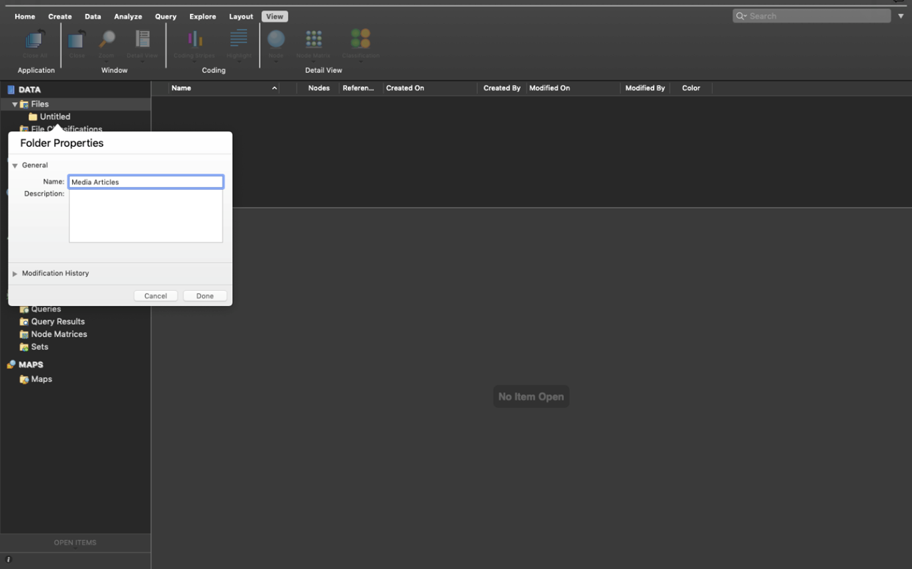
 
Then click ‘Done’. You can then create a second folder entitled ‘EU Strategy’ and a third folder entitled ‘Academic Journal Articles’. We’re now beginning to organise where our documents will go.

## Importing Data

Now we have folders we can import our data into these.

There are different things enabled during the import of data. For now, the straightforward importing of data, whether it is Text, PDF or the full range of audio-visual data – can follow essentially the same process. You just have to be careful to tell the software what type of data you are looking for (e.g., ‘document’, ‘PDF’, ‘NCapture’, etc.).

Remember that ‘data’ and Files in NVivo are any material at all that will help you to integrate all the information that feeds into your project.

### Activity 6: Import data

For now, let’s just import your data and not worry about how you will organise data (with attributes or socio-demographic variables). First, make sure the Files folder where you want to import your documents in the Navigation View is highlighted. For instance, we’ll start by importing the PDFs of our media articles, so single click the ‘Media Articles’ folder to highlight it.

 
Second, right click in the ‘List View’ to access the menu. Your ‘List View’ always corresponds to which source (i.e., Files, Codes, Cases…) is in use in your Navigation View. Now select ‘Import’ and then ‘PDFs’.

 
This will bring up your computer’s file search folder. Locate the folder where you saved your media articles and select the first one to import. Double click or select it and click "Import".

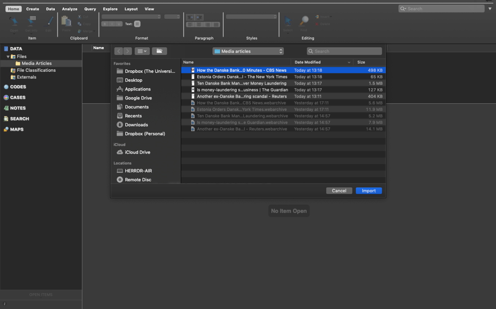
 
Once imported, you’ll then need to name this document. I’ve called my first media article ‘Reuters Article DB’. Then click ‘Done’.

 
Your first article will now be imported. You’ll see it has appeared in your List View and the contents of the article can be seen in the Detail View.

You now need to repeat this process for all your media articles, your journal articles and your other literature. You’ll then have 15 documents imported into NVivo.

The key point to note here is that we can integrate different sources of data (e.g., media articles, academic literature, official reports) into one place to manage them together. You can even use *NVivo* to undertake your literature reviews in preparation for essay writing – we’ll look at this next week.

When you import documents they can sometimes look a bit messy. With Word documents and other editable data, you can make changes to the document so it is easier to follow. If the document is editable, you can click ‘edit’ in the top right hand corner of the Detail View. Keep this in mind for future.

**Note 5**: *Edit mode/Read only mode* - note that it is always possible to make changes to textual documents once you’ve imported them, but unless you change the default option, your files by default will be in protected *"Read only"* format when on display in the Detail View.

Everything is now neat and tidy!

If you wish to close documents, you need to do this in the bottom left hand corner by clicking the small cross in the corner of the document you wish to close:

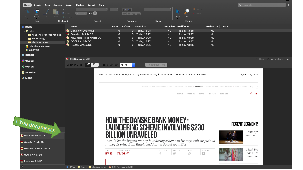

So, we now have all our documents in NVivo. What next? We need to think about why we are going to analyse these documents. To do this, let’s use the ‘Memos’ folder that appears under the ‘Notes’ section on the left hand side.

## Memos

The *Memo* folder allows you to create any number of new documents as locations to write notes and keep track of your analysis. If the new documents are created within or moved into the memo folder, the software sees them as memos and each memo can be linked to one document or node (we’ll explain this in due course).

Material inside any of the above sources can be classified, coded, linked, and annotated according to needs of the researcher. We’ll do this mostly next week…

Memos are related to planning, tracking processes and thinking ‘out loud’ about what is going on in your data. With that in mind, let’s create a framework of memos. You can create folders to organize different aspects of note-making. Or you can have the one predefined folder Memos, but within it name your memos carefully with standard prefixes which tell you and others what type of memo it is – “PROCESS-…”, “THEORY…”

You create folders from the memos folder – Right click/New folder /name the folder as above. 

Or create memos within your chosen folder by using the *"Create"* ribbon tab along the tab/choose the memo icon - or alternatively as usual – you can select the correct folder and then right click in the List pane to create the new memo. We find right clicking is always the most straightforward way. The new memo opens up in Edit mode so that you can begin work in it. If the memo closes, double click on the memo in the list, it will re-open but you will have to ‘click to edit’ in order to write in it. So let’s try this.

### Activity 7: Memos

See if you can follow what we’ve done for your own data.

We’ve created two folders: ‘Research Questions’ and ‘Theoretical Framework’:

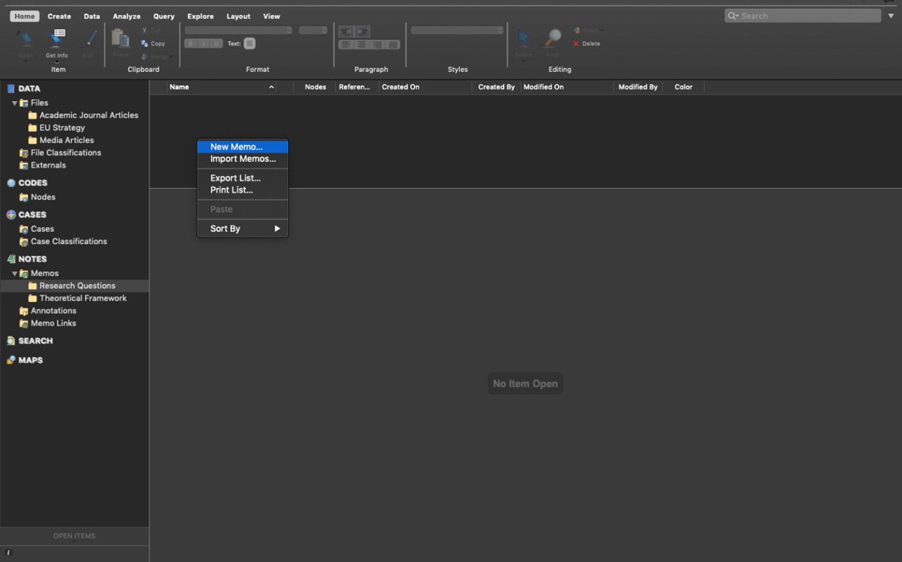
 
We’ve highlighted the research questions folder, then right clicked in the List View to create a new Memo called ‘RQs’. We’ve then clicked in the Detail View and started making notes on our research questions.
 
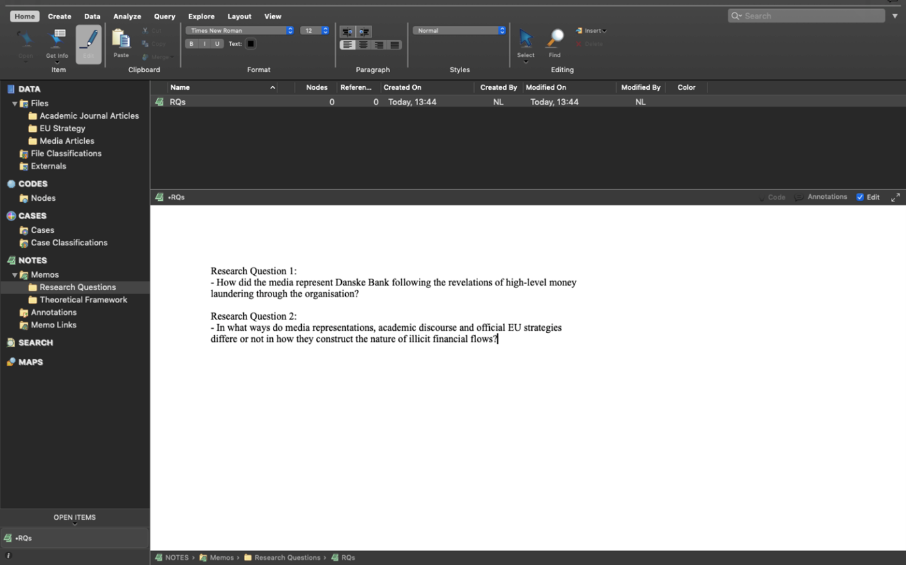

As you can see, in our first research question we are interested in analysing how the media represented Danske Bank after news of the money laundering scandal emerged.

In the second question we are aiming to analysis how media constructions differ from academic discourse and EU strategy discourse, if at all.

We’ve also created a second Memo entitled ‘Theoretical Framework’. In here we’ve made notes on which criminological theories we might use to inform our analysis. For instance, we’ve made notes about [rational choice theory](https://en.wikipedia.org/wiki/Rational_choice_theory_(criminology)) and [routine activities theory](https://en.wikipedia.org/wiki/Routine_activity_theory). These theories can guide our analysis.

 
When we analyse our data (we’ll do this properly next week), we can begin to integrate our different data sources together and organise the data around key themes and codes. Coding our data is by far the most important step!!! Coding schemes and coded retrieval are key tools of qualitative analysis. To do this in NVivo, we use ‘Nodes’.

For now, forget about ‘nodes’ and coding your data. We’ll do this next week in much more depth. Instead, we’re going to learn to do a basic, superficial analysis of our textual data.

## Word frequency

Finding ways to give others insight into your qualitative data can be challenging. You often end up with pages of response text, which would quickly overwhelm readers. However, considering word frequency is a great option for instant accessibility to this qualitative data.

Word clouds, a visualisation of word frequency, can add clarity during text analysis in order to effectively communicate your data results. Word clouds can also reveal patterns in your responses that may guide future analysis. You can read more about Word clouds [here](https://boostlabs.com/blog/what-are-word-clouds-value-simple-visualizations/).

### Activity 8: Word frequency

You’re now going to analyse your imported documents by the frequency with which words appear in them. To do this, first, open up the *‘Queries’* section in the Navigation View under the ‘Search’ heading. Then select ‘Queries’ and right click in the List View pane. You’ll then get the options as below. Select ‘New Query’ and then ‘Word Frequency’:

 
This will open up the ‘Unnamed Query’ panel in the Detail View. At this point, simply ensure all the default settings are selected and click ‘Run Query’.

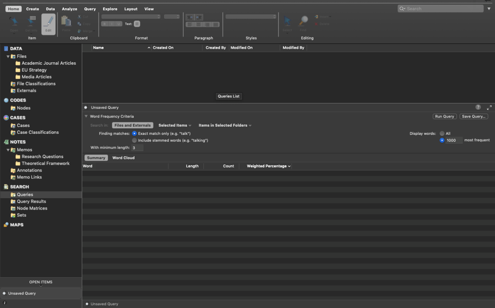
 
This will produce a list of all the words in all your documents and order them according to ‘Count’ i.e. the word with the most hits appears at the top:

 
This is not great to look at so what we can do is create a ‘Word Cloud’. Simply choose the ‘Word Cloud’ option at the top of the Detail View and this translates your query into a neat visualisation of the word frequencies:

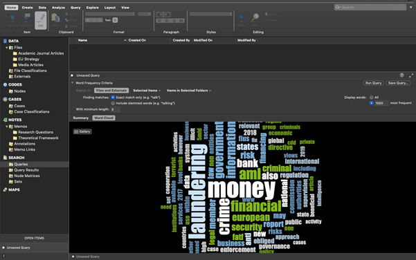
 
We can then save this image as a picture. Right click anywhere in the Detail View and you’ll have an option to ‘Export’. Select this:

 
Make sure you choose a suitable file format, such as JPEG Image. Give the Word Cloud a name and click Ok.
 
Your Word Cloud is then saved as a picture, like below. You could then insert this into any of essays or reports as an example of a superficial, but indicative, insight into the content of your documents.

 
That said, considering all our documents were identified in relation to ‘money laundering’, it was pretty obvious that ‘money laundering’ would be the main term, isn’t it?! In other words, the findings here are an artefact of my data search at the start.

How about we remove ‘money laundering’ from our word frequency query? To do this, you can go back to the ‘Summary’ tab, right click on the word you want to exclude, and then choose ‘Add to Stop Words List’.

 
Do this for ‘laundering’ as well, then run another query, as above, and see what happens now.

If you like the new Word Cloud better, you can then ‘Save Query’, give it an appropriate title and it will save in your project.
 
We’ve then followed the above directions again to save the Word Cloud as a JPEG for future use.

 
What does this tell us? Well, to be clear, this is a crude analysis. But it does throw up some interesting key words: ‘information’, 'aml' (which stands for 'anti-money laundering'), 'government', ‘bank’, ‘financial’, etc.

We can use these words to direct our coding of the data (or not). We’ll look at this more next week.

### Activity 9: Create two distinct word clouds

This is pretty cool, isn't it? But we can even go one step further and ask ourselves: will the word cloud for 'academic journal articles' be similar to that of "media articles"? Do they use remarkably different terms when they discuss this issue?

To do that, we first need to select the subset of pdf documents we are interested to analyse (by clicking on "Selected items"), and then click on "Run query" again.

Let's start by generating the word cloud for *academic journal articles*. Click on "Selected items", open the "Files" folder, and select only the "academic journal articles folder". Like so:

Press "OK", and then "Run Query". Open the Word Cloud, and save it as a jpg file.

Then repeat the same process but selecting only the pdfs in the "media articles" folder.

And once again, press on "Run Query" and save the resulting word cloud.

Now, these are our word clouds for **academic journal articles**:

And **media articles**:

They looks quite different, don't they? Interesting! Have a chat in small groups to discuss why you think these two word clouds are so different from one another.

If you obtained slightly different word clouds, it may be because we had previously added the words "money" and "laundering" to the "Stop words list"!

## Summary

You now know how to create a project in NVivo, import relevant documents, organise them into folders, tidy them up, create memos to structure your thinking, and undertake a basic analysis of your documents for frequencies.

These are all fundamentals to using NVivo. Of course, there are lots of tabs, functions and areas we haven’t explored, and won’t explore. These are much more advanced tools.
Next week we’ll build on these basics and put our minds to work on developing conceptual frameworks through coding our data – this is where the systematic analysis begins…

