# Week 8 {#week8}

## Learning outcomes

This week is the most fun week in all of data analysis - the week where we learn about the principles of data visualisation. The visual display of your data is so important because it allows you to communicate what is interesting in pictures. Simple, neat graphs can tell you, in one glance, what you might have to read many paragraphs of text to learn otherwise. Visualisation is an art and a science, and this week, we will explore the work in this area. Hopefully, you will only produce beautiful and meaningful visualisations of your data from now on. 

Here are some terms that we will cover today: 

- Visualising data
- Principles of good data visualisation
    + Ink to data ratio
- Grammar of graphics
- Exploratory viz
- Communicating results


## Visualising data


A picture is worth a thousand words; when presenting and interpreting data, this basic idea also applies. There has been a growing shift in data analysis toward more visual approaches to both interpretation and dissemination of numerical analysis. Part of the new data revolution consists of mixing ideas from the visualisation of statistical analysis and visual design. Indeed, data visualisation is one of the most interesting areas of development in the field.

Good graphics not only help researchers make their data easier to understand by the general public, but they are also a useful way to understand the data ourselves. In many ways, it is very often more intuitive to understand patterns in our data than to look at numerical results presented in a tabular form. 

Recent research has revealed that papers with good graphics are perceived as clearer and more interesting overall, and their authors are perceived as smarter (see [this presentation](https://vimeo.com/181771433)).


### Why visualise data?


**New insights:** Visualising data can give you new insights into your data (exploratory data visualisation) and effectively communicate the results from your studies to your audiences. You may recall the examples from the video lectures about how data visualisation had allowed John Snow to determine where the Cholera infections were coming from or Florence Nightingale to understand the causes of death of soldiers in the Crimean War. By visualising data, you allow yourself and your readers to engage with the conclusions you are hoping to draw. 


We saw, when discussing ways to summarise variables (univariate analysis) that it is only through multiple approaches that we can get the full picture. Recall the issues with the mean (remember the example of the white rainbow in *'The Tiger that Isn't'* book, or the rating for the film *' An Inconvenient Truth'*, where we needed the standard deviation to fully understand what was going on, as well as the mean?). Well, visualisation is another way to drill this down. And it is often necessary. For example, have a look at the figure below, in which 4 data sets are graphed on four different graphs: 


In this case, each data set has the same exact summary statistics, but through visualisation, we can see they look quite different actually!


**Engaging your audience:** You might also recall seeing some interactive data visualisations. These are something that has the power to really engage people with a topic. Instead of just passively telling people numbers in a table, visualisations can help engage your reader. But don't take our word for it; give it a go yourself! Remember in the video lecture where we drew the line, trying to guess the relationship between poverty and university attendance in the United States? Have a look at some more examples of interactive data visualisations [here)](https://www.tableau.com/en-gb/learn/articles/interactive-map-and-data-visualization-examples) and try them out yourselves. It should be an interesting little activity!


We won't quite be learning how to make these kinds of interactive visualisations, but we will learn some basic principles behind effective data visualisation. By the end of today's lab, you should also have a practical sense of why some graphs and figures work well while others may fail to inform or actively mislead. You will know how to create a wide range of plots in Excel as well as how to refine plots for effective presentation.


## Anatomy of a plot - the Grammar of Graphics


>  The grammar of graphics takes us beyond a limited set
of charts (words) to an almost unlimited world of graphical forms (statements).
The rules of graphics grammar are sometimes mathematical and
sometimes aesthetic. 

- Leland Wilkinson (2005) *The Grammar of Graphics*


First things first. In order to create effective visualisations, we must learn the **grammar of graphics**. The grammar of graphics is about creating graphs mathematically. Essentially, the philosophy behind this is that all graphics are made up of layers, the idea that you can build every graph from the same few components: a data set, a set of geoms—visual marks that represent data points, and a coordinate system.

Take this example (taken from *Wickham, H. (2010). A layered grammar of graphics. Journal of Computational and Graphical Statistics, 19(1), 3-28.*):

You have a table such as: 


You then want to plot this. To do so, you want to create a plot that combines the following layers: 


This will result in a final plot: 


Here, you see, we have built up our visualisation incrementally. In Excel, this is a bit backwards in that rather than adding the layers, we will have to start by selecting a chart type (which we've been doing thus far), so we would encourage you to take a step back and for each visualisation you produce, try to think, what would the layers look like? That sort of thinking should be used to guide you towards the selection of the appropriate chart and so on. 


## Principles of good data visualisation 


There is vast research into what works in displaying quantitative information. It is an emerging and ever-growing field. You saw examples from the 19th century in the videos, and hopefully, you listened to the podcast episode of data stories on the preparation material, which discussed data visualisation of our most recent pandemic. In between, there has been lots and lots of research and work in visualisation, which we can tap into. 


The classic book, which we mentioned in the video lectures, is [The Visual Display of Quantitative Information by Edward Tufte](https://www.edwardtufte.com/tufte/books_vdqi). Since then, many other researchers have focused on approaches to displaying data. Your reading for this week includes the book *'The Truthful Art'* by Alberto Cairo, which is a great guide. We can also recommend the books and website of [Andy Kirk](https://www.visualisingdata.com/). Or just listen through some more episodes of the Data Stories podcast. It really is quite fun! But now, let's move on to the lab activities for visualisation.

### The data-to-ink ratio - minimalist viz

The **Data-Ink ratio** is a concept introduced by Edward Tufte, an expert whose work has contributed significantly to designing effective data presentations. In his 1983 book, *'The Visual Display of Quantitative Data'*, he stated the goal of data visualisation is to "Above all else show the data". 

> A large share of ink on a graphic should present data-information, the ink changing as the data change. Data-ink is the non-erasable core of a graphic, the non-redundant ink arranged in response to variation in the numbers represented

- [Tufte, 1983](https://www.edwardtufte.com/tufte/books_vdqi)


Tufte refers to data-ink as the non-erasable ink used to present data. If data-ink is removed from the image, the graphic will lose the content. Non-Data-Ink is, accordingly, the ink that does not transport the information, but it is used for scales, labels and edges. The data-ink ratio is the proportion of Ink used to present actual data compared to the total amount of ink (or pixels) used in the entire display. (Ratio of Data-Ink to non-Data-Ink).


Good graphics should include only data-Ink. Non-Data-Ink is to be deleted everywhere where possible. The reason for this is to avoid drawing viewers' attention to the data presentation to irrelevant elements.
The goal is to design a display with the highest possible data-ink ratio (that is, as close to the total of 1.0) without eliminating something necessary for effective communication.


### An example: 


This is an example of a graph with a low Data-Ink Ratio:


The border around the graph, the background colour and the grid lines are all unnecessary data ink.


Now, an example of a graph with a high Data-Ink Ratio:


We have deleted the border around the graph, the background color and the grid lines and have thus drawn the viewer's attention to data-ink horizontal scales. There is nothing else to distract from, and the key features of the data stand out clearly. 


### Criticisms


Ohad Inbar and his collaborators evaluated in 2007 the people's acceptance of the minimalist approach to visualising information. They asked 87 students to rate their preference for two different graphs displaying identical information - a standard bar graph and a minimalist version ([Inbar et al., 2007](http://portal.acm.org/citation.cfm?id=1362587)). The results showed that the majority of students did not like Tufte's minimalist design of bar graphs - instead, they seem to prefer "chartjunk" ([Inbar et al., 2007](http://portal.acm.org/citation.cfm?id=1362587)).


In the example shown above, increasing the data-ink ratio made it harder to read most of the data. For example, removing the top border of the chart removed an implied 20% line. It also made it harder to see how much the graph lies (in that it does not show a range from 0% to 100% and/or does not show the domain from January through December). ['How to Lie with Statistics'](https://www.librarysearch.manchester.ac.uk/primo-explore/fulldisplay?docid=44MAN_ALMA_DS21134626320001631&context=L&vid=MU_NUI&search_scope=BLENDED&isFrbr=true&tab=local&lang=en_US) discusses this flaw in the example charts.


## What makes a bad graph bad?


Whether or not you subscribe to Tufte's school of minimalism, you should be able to recognise *bad* graphs. What makes a bad graph bad, though? The generic overview answer to this is that bad graphs make it difficult for your audience to interpret the meaning you are trying to convey. 


Let's start with an activity where we engage with a chart.

### Activity 8.1: What do you think?

Here is a data visualisation that shows the life expectancy of people who live on different continents. In small groups, have a chat about this. What do you like about it? What do you not like about it? Do you think it meets the five criteria set out by Alberto Cairo in your readings (truthful, functional, beautiful, insightful, enlightening)? Write some notes about this in your shared document.


Depending on your discussion, you may have decided to approve or reject this graph as something you might include in your report. One feature, which we hope you picked up on, is the 3-dimensionality of the chart. Remember in the video lecture when we showed how introducing a 3rd dimension, for example, in a pie chart, can actually mislead? Once again, this might be an issue. You can also see an example in the graph below: because of the angle and the 3D, a reader may struggle to read the extent of differences between regions. 

So does this mean there are hard-and-fast rules for dos and don'ts in data visualisation? Well, no, not really. There may be an instance when 3D is a good way to go, for example, when the 3rd dimension visualises a variable and conveys some meaning. Take, for example, this chart, which models the population of different wards in London, where the height of each ward is the total population projected. 


Source: [https://www.business-live.co.uk/professional-services/consultancies/sewell-group-adds-tech-specialist-19343411)


Like all good questions, the answer is, "It depends".


### It depends...

When to use what chart is mostly up to you, but it is important to justify the choices you make and keep in mind what you learned in your readings about the truthful, functional, beautiful, insightful, and enlightening role of each visualisation. There are also trends in data visualisation. A good example of this dilemma is the pie chart. 

> A pie chart is perhaps the most ubiquitous of modern graphics. It has been reviled by statisticians (unjustifiably) and adored by managers (unjustifiably). It may be the most concrete chart, in the sense that it is a pie. A five-year-old can look at a slice and be a fairly good judge of proportion. (To prevent bias, give the child the knife and someone else the first choice of slices.) The pie is so popular nowadays that graphical operating systems include a primitive function for drawing a pie slice.

- Leland Wilkinson (2005) *The Grammar of Graphics*


Indeed, a lot of people shun the pie chart (see, for example, this blog entry titled ["Death to pie charts"](http://www.storytellingwithdata.com/blog/2011/07/death-to-pie-charts), but managers have a particular affinity towards it. While these seem emotional and unfair, there is actually a justification for these. People are actually *not* that great at telling proportions from pie charts. If you are interested, have a look at [this study](https://eagereyes.org/blog/2016/a-reanalysis-of-a-study-about-square-pie-charts-from-2009), where researchers found that a square pie chart performs the best when people have to guess the proportion that it represents (also discussed in our recorded lecture videos). 


There are other charts as well, which are less popular to hate but, in certain situations, may obscure important information. In some cases, bar plots can hide important features of your data and might not be the most appropriate means for comparison. See the below image, for example, where the same data about two groups, green and purple, are visualised using three different methods: a histogram, which shows the green group following a normal distribution and the purple group following a heavily skewed distribution (remember week 5), a boxplot that shows the same, and finally a bar plot, which makes the green and purple group appear identical: 


The  [kickstarter campaign](https://www.kickstarter.com/projects/1474588473/barbarplots/description) around actually banning bar plots might be a bit of an extreme leap, but it is important to keep in mind that the kind of visualisation that you choose might greatly impact the conclusions that people will draw about your data and the story you can tell. 


There are some recommendations on what to use (and not use) in certain contexts, which can help you avoid making a bad graph. For example, most data visualisation experts agree that you should not use 3D graphics unless there is a meaning to the third dimension. Using 3D graphics just for decoration, as in [this case](https://mir-s3-cdn-cf.behance.net/project_modules/disp/2505dd10837923.56030acd2ef20.jpg) is normally frowned upon. However, there are cases when including a third dimension is vital to communicating your findings. See this [example](http://www.visualisingdata.com/2015/03/when-3d-works/).


We want to create pictures of data that people, including ourselves, can look at and learn from.

However, it is not always enough for you to know the perfect visualisation; it is important that you also know that your audience is comfortable interpreting these types of visualisations. A friend of ours told us once that before she became a lecturer, she worked as a crime analyst. She loves data and was coming out of her education, so she felt very comfortable with statistics and data analysis. However, her lack of real-world experience was evident when she entered her first-ever briefing, with three Chief Inspectors from the Met Police to present them with the work she'd done analysing confidence in the police. Her second slide was a set of boxplots comparing the scores on a public attitudes survey between their sectors. It might have looked something like this (the data is fictitious, by the way): 


```{r, echo=FALSE, message=FALSE, warning=FALSE}

library(ggplot2)
ggplot(mtcars, aes(y=mpg, x=as.factor(cyl)))+
  geom_boxplot() +
  ylab("Confidence score (out of 50)") +
  scale_x_discrete(name ="Sector",labels=c("North","East","Central"))


```


If you don't understand boxplots, then you are not alone. They are not the most clear, but they do give you a very good summary of your numeric values. Remember the median and 1st and 3rd quartile? This is what makes a boxplot. Read up on them [here](https://en.wikipedia.org/wiki/Box_plot). 


It was useless. Our friend spent basically all her allotted time trying to talk through the graph, and it achieved the opposite effect of clearly displaying information and telling the story of the different levels of confidence in each Sector. She did not consider her audience, which made her visualisation ineffective.


## So... what graph should we use?!?


There are a lot of points to consider when choosing what graph to use to represent your data visually. There are some best practice guidelines, but at the end of the day, you need to consider what is best for your data. What do you want to show? What graph will best communicate your message? Is it a comparison between groups? Is it the frequency distribution of one variable? 


As some guidance, you can use the below [cheatsheet, taken from Nathan Yau's blog Flowingdata](https://flowingdata.com/2009/01/15/flow-chart-shows-you-what-chart-to-use/):


However, keep in mind that this is more of a guideline aimed to nudge you in the right direction. There are many ways to visualise the same data, and sometimes, you might want to experiment with some of these to see the differences. You can also consider some inspiration [here](http://datavizproject.com/). 


## Edges, Contrasts and Colors

Looking at pictures of data means looking at lines, shapes, and colours. Our visual system works in a way that makes some things easier for us to see than others. We are speaking in slightly vague terms here because the underlying details are the remit of vision science, and the exact mechanisms responsible are often the subject of ongoing research. We will not pretend to summarize or evaluate this material. In any case, independent of detailed explanation, the existence of the perceptual phenomena themselves can often be directly demonstrated through visual effects or “optical illusions” of various kinds. These effects demonstrate that perception is not a simple matter of direct visual inputs producing straightforward mental representations of their content. Rather, our visual system is tuned to accomplish some tasks very well, and this comes at a cost in other ways.

The active nature of perception has long been recognized. The Hermann grid effect, shown in the figure below, was discovered in 1870. Ghostly blobs seem to appear at the intersections in the grid, but only as long as one is not looking at them directly. 


A related effect is shown below. These are Mach bands. When the grey bars share a boundary, their apparent contrast appears to increase. Speaking loosely, we can say that our visual system is trying to construct a representation of what it is looking at based more on relative differences in the bars' luminance (or brightness) rather than their absolute value. 


Similarly, the ghostly blobs in the Hermann grid effect can be thought of as a side-effect of the visual system being tuned for a different task.

These sorts of effects extend to the role of background contrasts. The same shade of grey will be perceived very differently depending on whether it is against a darker background or a lighter one. Our ability to distinguish shades of brightness is not uniform, either. We are better at distinguishing darker shades than we are at distinguishing lighter ones. And the effects interact, too. We will do better at distinguishing very light shades of grey when they are set against a light background. When set against a dark background, differences in the middle range of the light-to-dark spectrum are easier to distinguish.

Our visual system is attracted to edges, and we assess contrast and brightness in terms of relative rather than absolute values. Some of the more spectacular visual effects exploit our mostly successful efforts to construct representations of surfaces, shapes, and objects based on what we are seeing. Edward Adelson’s checkershadow illusion, shown below, is a good example.


So, why does all this matter? What does this have to do with data analysis? These are all things that affect how your audience will perceive your visualisation. Your visualisation should consider how your audience perceives, understands, misunderstands, etc., and what you show them. Every decision you make has an effect, not only on what chart to choose but also on other details, such as questions of colour. In the next section, we explore this further. 


## Colour

When choosing a colour palette, the first thing to consider is what kind of colour scheme we need. This will depend on the variable we are trying to visualise. We go back, once again, to the first week of the course, where we discussed *Levels of Measurement*. Remember those? Still important!


Depending on the kind of variable we want to visualise, we might want a Qualitative colour scheme (for categorical nominal variables), a Sequential colour scheme (for categorial ordinal or numeric variables) or a Diverging colour scheme (for categorial ordinal, or for numeric variables). 

For qualitative colour schemes, we want each category (each value for the variable) to have a perceptible difference in colour. For sequential and diverging colour schemes, we will want mappings from data to colour that are not just numerically but also perceptually uniform. 


- **Sequential scales** (also called gradients) go from low to high saturation of a colour. 
- **Diverging scales** represent a scale with a neutral mid-point (as when we are showing temperatures, for instance, or variance in either direction from a zero point or a mean value), where the steps away from the midpoint are perceptually even in both directions. 
- **Qualitative scales** identify as different the different values of your categorical nominal variable from each other. 


For your sequential and diverging scales, the goal in each case is to generate a perceptually uniform scheme, where hops from one level to the next are seen as having the same magnitude. Excel will take care of these for you by offering colour palettes in the "Design" section of the Chart Layout tab: 


Of course, perceptual uniformity matters for your qualitative scales and your unordered categorical variables as well. We often use colour to represent data for different countries, political parties, types of people, and so on. In those cases, we want the colours in our qualitative palette to be easily distinguishable but also have the same valence for the viewer. Unless we are doing it deliberately, we do not want one colour to dominate the others perceptually. 


The main message here is that you should generally not put together your colour palettes in an ad hoc way. It is too easy to go astray. In addition to the considerations we have been discussing, we might also want to avoid producing plots that confuse people who are colour-blind, for example, and colour blindness comes in a variety of forms. Fortunately, almost all of the work has already been done for us. Different colour spaces have been defined and standardized in ways that account for these uneven or nonlinear aspects of human colour perception.


A good resource website is [ColorBrewer](http://colorbrewer2.org/). This site offers many colour schemes that you can use in your graphs if you want to introduce manual colours. The site looks somewhat like this: 


### Activity 8.2: Picking a colour scheme


Let's say we want to pick a colour scheme to visualise the variable of perception of police. Let's say we're measuring this with one variable, operationalised as having asked people the extent to which they agree with the following statement: "I think the police are doing a good job in my area", where the values for this variable are: Strongly agree, Agree, Neither agree nor disagree, Disagree, and Strongly Disagree.


First things first, what is the level of measurement of this variable? Let's think about this for a minute, discuss it in groups, and write your answers. 


Now, what does that mean for your colour scheme that you might use? Are you going to pick qualitative, sequential, or diverging? Why? Take a minute to think and discuss. 


OK, hopefully, you had a discussion here. What did you answer? Did you pick qualitative? We hope not... Did you pick sequential? Good, you recognised there is an order that should be visualised. Did you pick Divergent? Also, it's good that you decided that you want to balance agreement vs disagreement! 

But wait, why is there more than one right answer?? Well **it depends** on how we interpret our values for our variable. We know this is a categorical, ordinal variable, as there is an order from most to least agreement. However, there is a middle point. We might say that what we want is a completely positive perception of police effectiveness. In that case, we are happy when people answer 'Strongly agree', so we will pick this as our strongest saturation of a sequential palette, and anything less than this is an issue to be remedied. In that case, the answer 'neither agree nor disagree' is not a neutral outcome because it's someone who isn't convinced of the effectiveness of the police. 

On the other hand, you might think that any agreement is good and any disagreement is bad. In that case, the neither agree nor disagree represents a neutral middle ground, and in that case, you would want your colour scheme to reflect that by having a neutral middle point, and you choose a divergent scale. 


All right, now you have chosen a scheme. Let's here stick with sequential, only the maximum police effectiveness perceived will do! So now, how can we find out what are some good colours to use? Well, in the video, we mentioned we'd learn some tips and tricks, so let's get started: 

Go to the site [http://colorbrewer2.org/](http://colorbrewer2.org/), and select sequential from the colour scheme options: 


When you do, you can see that you can adjust the number of categories that you need to create a colour scheme for: 


You will set these to the number of values in your categorical variable, for example. In the case of police effectiveness? How many values were there? Strongly agree (1), Agree (2), Neither agree nor disagree (3), Disagree (4), and Strongly Disagree (5). So, we will need five colours for our variable's five values.  Now, you can pick your favourite scheme and use these!


You might think that's really nice, but how do we get these colours into our Excel graphs? Well, you may notice the code next to the colours:


These are ways for the computer to understand what the value is for that colour. There are a few options. Here, we see HEX values for each colour. 


A hex triplet is a six-digit, three-byte hexadecimal number used in HTML, CSS, SVG, and other computing applications to represent colours. The bytes represent the red, green and blue components of the colour. One byte represents a number in the range 00 to FF (in hexadecimal notation) or 0 to 255 in decimal notation. This represents the least (0) to the most (255) intensity of each of the colour components. Thus, web colours specify colours in the True Color (24-bit RGB) colour scheme. The hex triplet is formed by concatenating three bytes in hexadecimal notation in the following order:

- Byte 1: red value (colour type red)
- Byte 2: green value (colour type green)
- Byte 3: blue value (colour type blue)


Not sure if you might still be the generation that had any interaction with MySpace, but that was an excellent venue to learn about hex colours and HTML customisation. We guess a potentially more relevant venue would be Tumblr; if any of you use this and want to customise your pager, [you can use HTML to do this](https://www.tumblr.com/docs/en/custom_themes). Now, you don't need to do this at all, but you should now know that if you want to change the colour of something, you need to know the hex code for this colour. And this is what Colourbrewer is telling you above. 


If you want the three colours you see there, you must use the codes `#ffeda0`, `#feb24c`, `#f03b20`. 


You can also change the display from HEX to RGB or CMYK codes, which are just used in different contexts. You can ask *ColorBrewer* to display these codes instead by changing the value in the dropdown menu: 


**DON'T FORGET ACCESSIBILITY**. You can see that in *ColorBrewer*, you can also choose to select a scale which is "colourblind safe". Tick this box to filter out any schemes which might not comply with good accessibility standards. Do pay attention to this sort of thing. If you have another scale or want to use, for example, corporate colours, other tools are available. For example, in the video lectures, we mentioned the tool [https://coolors.co/](https://coolors.co/), where you can simulate different kinds of colour blindness. You can use this in your designs. 


Right, but how do we get these colours into our Excel graph? Let's give it a go.


### Activity 8.3: Custom colours in Excel graphs 


Download the FBI crime statistics data from Blackboard under Week 8 in Learning Materials.


Open the data in Excel and have a look at it. You can see that it includes the number of crimes for various crime types for each year from 1994 to 2013, as well as some columns for crime rates. Crime rate is important because it normalises the *number* of crimes by the population at risk. Why is this important?


Well, think about this - where do you expect more pickpocketing incidents, outside Piccadilly Station or in Platt Fields Park? Why? 


Our guess is that you said Piccadilly Station because there are more people close together. There are **more possible targets**. That's what you are accounting for when calculating crime *rates*. In this case, they are accounting for changes in the population between the years to make sure that you can compare the crimes between the years. It might not make a lot of sense to say that a particular crime is increasing if the population is also increasing because as a percentage, the crime might not actually be increasing at all. So, instead, we consider the population. 


But is the population increasing? Well, let's create a column graph of the population. 


To do this, select the *Population* column and choose the clustered column graph option: 


You can see, however, that the category axis labels are not very meaningful. They are only numbers, from 1 to 20, and do not help you answer whether the population changes between the years. 


To add axis labels, right-click anywhere on the chart area and select the "Select Data..." option: 


Then, click into the text box next to the *Category (X) axis labels*, and then select the values in the *Year* column. **Make sure to select only the values and not also the column header**: 


Now we can see the differences. However, we wanted to demonstrate how to change the colour of your graphs to what you wanted, potentially some colours from *ColorBrewer*. 


To do this, you can double-click on any of the bars, which should open up a popup window. 


On this, select the "Fill" option. On this, you can see a dropdown menu where you can select the fill. 


If you're on a PC, double-click on the bars and on the right side, and various "Format Data Series" options will appear. Click on the "Fill & Line" option, then "Solid Fill", then the colour option will appear: 


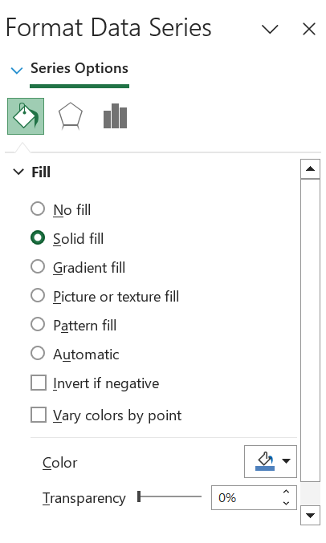


Click on the option for "More Colours..."


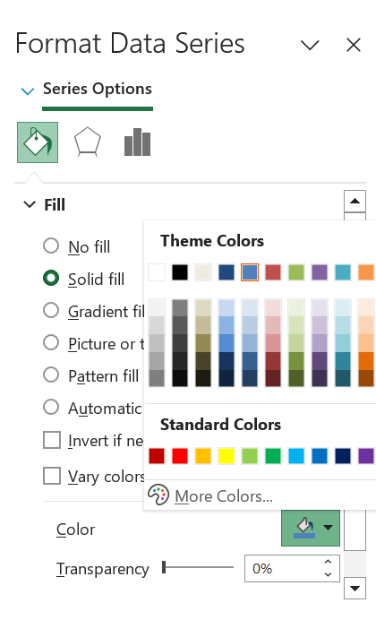


This opens up a new set of options. You can see it's set to RGB sliders. If you want to, you could use the RGB code and set the red, green, and blue levels in a way that gets you your colour. You can also just paste your hex code in the box below the sliders that says "Hex Color #". If you are using a PC, we'll get to this in a second. 


So, let's say that we want to change the colour to the middle value from the colourbrewer scale above. Well, we can see that the hex code for that is `#feb24c`. So what we need to do is change the code in the text box above, where it says "FFFFFF" to "feb24c": 


From the drop-down selection menu on the ['ColorBrewer' website](https://colorbrewer2.org/#type=sequential&scheme=BuGn&n=3), you can swap between the HEX or RGB codes.

<!-- 


 And set it to "RGB" scale. This will give you the values for the red, green, and blue sliders. In this case, that will be:

- R: 254
- G: 178
- B: 76
-->

Enter those values in the pop-up window that appears:


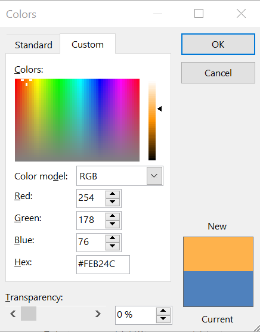


 Once you set the colour codes, click "OK", and ta-daa, your graphs will appear with manual colour: 


In this case, we don't have a stacked bar; we just have one variable, so it's not hugely useful, but we wanted to demonstrate how you can insert your own colours there. You might want to do this later in the more complex graphs. Your decisions about colour will focus more on when and how it should be used. Colour is a powerful channel for picking out visual elements of interest and can really make a difference to your graph. You are welcome to use the Excel default colours in your graphs within this course, but if you're interested in learning more about colour, have a look [at this page](https://lisacharlotterost.github.io/2016/04/22/Colors-for-DataVis/). 


## Reading between the lines (points) 


What sorts of relationships are inferred, and under what circumstances? In general, we want to identify groupings, classifications, or entities that can be treated as the same thing or part of the same thing:

- **Proximity:** Things that are spatially near to one another are related.
- **Similarity:** Things that look alike are related.
- **Connection:** Things that are visually tied to one another are related.
- **Continuity:** Partially hidden objects are completed into familiar shapes.
- **Closure:** Incomplete shapes are perceived as complete.
- **Figure/Ground:** Visual elements are either in the foreground or the background.
- **Common Fate:** Elements sharing a direction of movement are perceived as a unit.


## Exploratory data visualisation


Data visualisation helps you unlock the hidden meaning in your data. It is the first tool of a data analyst. When you are given a heap of data, the only way to get some insight into it is to make some visualisations. In weeks 2 and 3, when we did our univariate and bivariate analyses, we always started with graphing our data. And in some instances, visualising data itself can lead to surprising insights. 


We suggest that in your own time, you listen to [this episode of the DataStories podcast](http://datastori.es/66-iquantnyc/), which consists of an interview with Ben Wellington, the author of the blog [I Quant NY](http://iquantny.tumblr.com/). We mentioned him in the opening lecture; he's the guy who found the [fire hydrant that earns $30,000 a year](https://www.dailymail.co.uk/news/article-2618927/Blurred-lines-How-New-York-fire-hydrant-sees-33-000-flow-city-coffers-parking-fines.html). It's a good interview, so definitely bookmark it for later!


Exploratory data visualisation is a way to get to know your data. It is a way to explore patterns and trends that you might not immediately see. We covered some of this when we performed univariate and bivariate analyses. Still, we will focus on how data visualisation can help you answer questions about your data and also make sure these graphs align with good practice. 


### Activity 8.4: Comparing categories


Let's practice answering questions with data. Go back to the FBI data you downloaded from Blackboard. 


Firstly, let's say we want to know the answer to the following question: 

- **What year had the highest violent crime rate?**


You can see that the appropriate data is in the column labelled *Violent Crime Rate*. So, what do you think is the best way to visualise this? You could look at your chart selection thought starter above and see that one option for comparisons is to use column graphs. So, let's give that a go: 


Select the column that contains the data for the violent crime rate. Highlight it. When you have highlighted that column, go to your chart selector and select *Column* > *2-D Column* > *Clustered Column*. Like so: 


Once you select this, a default column chart should appear. You can see, however, that the category axis labels are not very meaningful. They are only numbers, from 1 to 20, and do not help you answer your question, *What year had the highest violent crime rate?*


To add axis labels, right-click anywhere on the chart area and select the "Select Data..." option: 


Then, click into the text box next to the *Category (X) axis labels*, and then select the values in the *Year* column. Make sure to select only the values and not also the column header: 


Once you've done that, click on "OK", and you will see the labels updated: 


Now you can see that your x-axis labels are meaningful, and essentially, from this point on, you can use this graph to answer your question: *What year had the highest violent crime rate?*. 


We can see that 1994 had the highest violent crime rate. 


However, this graph is not necessarily in line with the best practice around data ink and not all of the visuals introduced have meaning. 


Firstly, we are talking about the number of crimes per 100,000 population. Since we are talking about **number of crimes**, we know we will be talking about whole numbers. Even if we end up with some decimal points after dividing by population to get the rate, it would not necessarily be meaningful to report fractions of crimes. So, we can remove the .0 from the y-axis labels, as it adds no value to our graph. To do this, double-click on the text on the y-axis labels. It will bring up a window where you can see some choices to select what to edit on the left-hand side of the window. 


It might automatically be selected to "Scale":


Click on the next one down, the one that says "Number". In the options that come up, *untick* the box next to "Linked to source". Once you untick this box, you should have some options available for you to make changes. You can then edit the text box next to where it says "Decimal places" and set it to 0, like so: 


You can now also go to the other options and make changes there. For example, you might decide that you want to increase the font size to make your graph easier to read and also that you might want to change your font to something easier to read, such as Arial:


On a PC, the "format axis" window appears on the right side. From there, scroll down to "Number", edit the text box next to where it says "Decimal places", set it to 0, and press Enter. You can also make other changes from here. 


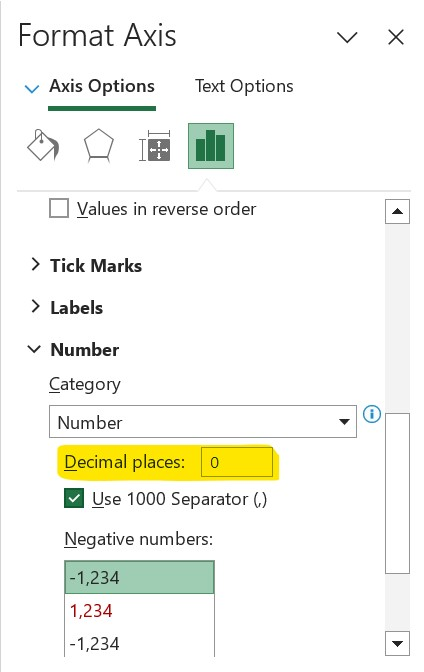


If you change your font, and also your font size, you should make sure to apply to all of your axis labels. To do this, double-click the x-axis labels (the years), and the same pop-up window will appear. Make sure to set the font to the same font and the font size to the same size for both axes to ensure consistency: 


The other bit of information you're providing here that doesn't have much meaning attached is colour. What does the blue in the bars mean? Is there a gradient on the colour of your graph? Why? These are questions that people looking at this chart might ask, and we, the people who made the chart, do not actually have any good answers!

You can change the aspect of your chart. If you click on your chart, two tabs will become available at the top, "Chart Design" and "Format", along with the window on the right side of Excel. These can be used to format your grpahs. Explore these options and see if you can improve the way your graph looks.

<!--And why is there a gradient? Why are the bars lighter blue on the top and darker blue on the bottom? These are questions that people looking at this chart might ask, and we, the people who made the chart, do not actually have any good answers to!
(actually on the PC there might not be a gradient, but on a Mac there is, and just in case, it's good to note this). 


So to get around this, let's set our bars to solid black, to get around any possible issues with introducing colour. To do this, this time double click on any of the bars, to open up a popup window. Again there will be options on the left hand side. First select the option for "Line" and make sure that you set this to "No Line": 


Then click on "Shadow" and make sure to just untick the box next to where it says "Shadow". Again there is no point to introduce a shadow here, as it would give you no additional information, it represents no data, and therefore can only introduce confusion into your chart. 


Finally, select fill, and set your fill colour to black: 


Once you are done with all this, you can click on "OK" and you will have your final bar graph ready to be inserted into a report: 


Ta-daaa. Is this the best graph to answer our question? Well you could explore a few more, and see what happens. -->

### Activity 8.5: Let's never make a pie chart again

How do I know the bar chart is the best way to present this data?? Am I sure? Could something else work better? Well, there is only one way to find out, and that is by exploring some more options! Let's try a pie chart. We keep hating on it, let's see if we should give it another chance. 


Once again, select the column you're interested in, which is the rate of violent crimes. Now, instead of choosing a column chart, choose a pie chart as your visualisation strategy. 


Now how does that look? Is it something like this: 


Can you answer your question using this chart? Do you know, from this, which year had the highest violent crime rate? 


How about from a donut chart:


Not really, eh? Well, it takes some time and thought to be able to determine what visualisation is best to use, and you can always try out a couple of options, and see which one you like best and which one best helps you tell your story and answer the question you are asking, and align with the five principles from your reading of being truthful, functional, beautiful, insightful, enlightening. And remember to think carefully and make decisions consciously, as there might be more than one right answer. 


For example, to answer our question *What year had the highest violent crime rate?* we could have just as well used a bar graph as a column graph. A bar graph is basically a column graph on its side:


### Activity 8.6: Exploring trends


We'll be talking about changes over time and trends next week, but it's interesting to note here how it would (or at least should) influence your chart choice if the question we ask is slightly different. Let's say we are still interested in trends in violent crime rate, but instead of asking which year had the highest violent crime rate, this time we are interested in a new question:


- **Is the violent crime rate going up, going down, or staying the same?**


We could, in theory, answer this question by looking at our bar graphs above. But the slight difference is bar graphs are good at comparing **categories**. But what they don't do is they do *not* link up these categories. And rightly so. Such charts are for visualising categorical variables, which should not hugely link.


However, those of you still on top of your *levels of measurement* will have noticed that year can actually be considered a continuous variable. And so it might lend itself to better *trend* visualisation by being presented through a *line graph*. 


To select this, once again highlight the column with the data of interest (violent crime rate) and then this time select Line > Line for chart type: 


Once again, you will see that your x-axis labels are not very helpful; they are numbers from 1 to 20 rather than labelled with the years that each data point represents. To address this, once again right-click anywhere in the chart and select the "Select Data..." option: 


In the popup, once again, click into the text box next to the *Category (X) axis labels*, and then select the values in the *Year* column. Make sure to select only the values and not also the column header: 


When you click OK, the labels should appear on your chart: 


You don't always have to manually change the bits of the graph; you can also use some pre-created layouts that exist. You can find this in the top bar of Excel, under "Chart Design" -> "Quick Layout": 


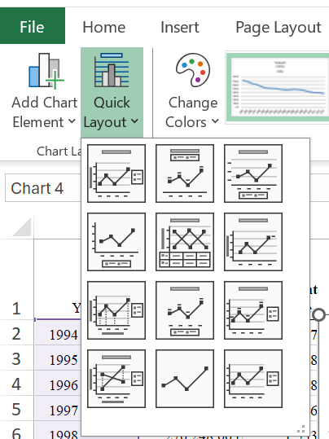


<!--Again, a difference on the PC: When editing the line graph, there is not a heading called "Chart Quick Layouts". Instead, you can find the options for different layouts under the **"Chart tools"** section and the tab called **"Design"**. 


-->


You can browse through and select one that looks like something you would like. 


Once you pick a quick chart format, you can still make edits to your graphs. For example, you can double-click on the line to make another popup, or on the right-hand side, a window will appear - "Format Data Series". 


On this new window, you can click on "Line" option, and choose the colour you would like for the line. 


You can also see several options along the topic there, where you can choose between whether you want to edit the line etc, under the "Solid" option, but also change gradients under the "Gradient" option, and also edit the style of the line using the "Weights & Arrows" option. Click on this, and have a play with this as well: 


Again these might be slightly different on your version, or on a PC to a mac. For editing the line, all the options there are different as well. The main point here is for you to just play around and see what is available to change in the graph, so have a look, but here is the equivalent PC screen shot to show you:


<!--  -->

You can also add point markers to the line. This can help add clarity to your graph. Select the "Marker Style" option and choose a marker.


On PC: 


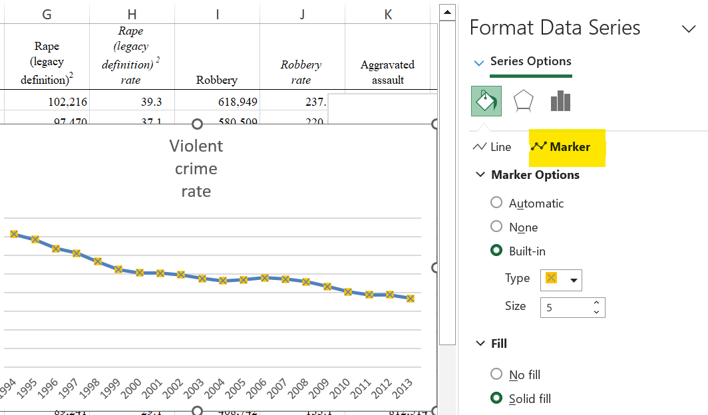


<!---->


Make any changes you would like, and produce your final graph. 


### Activity 8.7: Making a chart template


Now, you will probably find your own style for a graph, and you might not want to change these settings every time you create a graph. Let's say we want to create a separate graph for the rates of various crime types in this data. To make our lives easier, once we've gotten one graph to look just how we would like, we can save this as a template. 


To do this, right-click anywhere in the graph and select "Save as Template...". 


<!--On a PC you won't have this option appear from the right-clicked menu, but you can find the "Save As Template" on the Chart tools > Design tab on the top menu in Excel: 


-->


Choose a location to save, give it a name you might remember (here we call this "bw", short for black and white): 


On PC: 


Next time you build a graph, you can use this template. Let's try. Let's create another line graph, this time for the rate of murder and nonnegligent manslaughter. So, as you would, select the column with the data for the rate of murder and nonnegligent manslaughter:


But instead of selecting Line graph, click on the "Other" option for graphs and scroll to the bottom. You should see your template appear as one of the possible selections!


On a PC, go to "Insert" -> "Charts" and press the downward pointing arrow in the corner; a window will pop up; from there, select "All Charts" -> "Templates" and select the template you saved.  


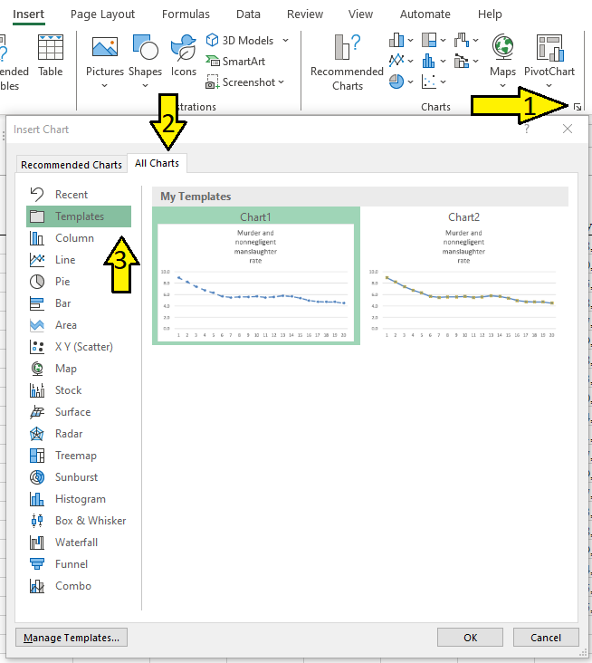


<!--Then go to templates, and choose "My templates":


-->

Click on the template, then click OK, and you should have your graph be updated to the new template. 


You can now see that the default chart that appears follows the formatting that you have carefully devised as your ideal format. You will still have to add any sort of data addition (for example specify where to find the years to populate the Category (X) axis labels). But it definitely saves you some time in terms of formatting. 


### Activity 8.7: Saving your graph


When you are making your reports, there are two ways you can include your graph. 


One approach is just to save your graphs as pictures. To do this, you can just right-click anywhere in the graph area, and select the "Save as picture..." option. 


Navigate to a folder where you collect your results, and save the image there. 


<!--Of course, because nothing is easy, this option does not exist on PC. Instead, perhaps the best option may just be copying the graph and pasting it into a Word document. If you want to save it as an image from there, you must make sure to paste as picture (right click, paste as picture) and then, if you want, you can right click your pasted graph (in Word) and from there select "Save as picture". This way you will save your png of your graph into a folder, and you can insert it into future reports. -->


Then, when you are writing your essay, you can insert an image using the Insert > Picture from file option: 


This will open up a popup window you can use to navigate to the picture you just saved and select it. When you are done, click "OK", and your graph will appear :


It is important that you **label your graphs**. You should include a short and to-the-point caption for the graph. You should also refer to the graph in your writing. Something like this: 


## Activity 8.8: More complex graphs


While we only covered descriptive analysis for univariate and bivariate analysis, when it comes to making sense of your data graphically, you can include further variables. 

<span style="color:#d95f02">
Let's show an example now. 


In the FBI data, you can see that we have quite a few columns (variables) for crime rates for various crime types. We looked at rates of violent crime and murder and nonnegligent manslaughter, but there is also robbery, aggravated assault, burglary, and some more. Let's say that we want to compare the trajectories of all these variables over the years, over time. 


You can start with a simple line graph for one of the variables. Let's select the violent crime rate, and build a line chart for this variable. You should be able to do this by now without guidance, but if you need assistance, just scroll up to where we did this earlier. 


Now, once you've created this graph, right-click anywhere on the chart itself and select the "Select Data..." option: 


In the popup that appears under the series box, click on the "Add" button:


Once you click on the "Add" button, the fields for "Name"/ "Series name" and "Y values"/ "Series values" should appear empty. Click in the text box next to name, and then click on the column header (variable name) for the next variable. Select "Robbery Rate":


Then, click in the text box next to the "Y values:" and then select the values in the robbery rate column: 


Then repeat this for every variable you want to add. For every variable, click on "Add", then for "Name" select the column header, and for "Y values" select the values for that variable. 


Repeat this for "Aggravated Assault Rate" and again for "Burglary Rate": 


Finally, when you have added all these variables, click on OK, make any changes you'd like to, to the graph, and then ta-daa you will see all 4 variables on one graph: 


You could also create a stacked column chart, that shows you the cumulative crime rate in each year, while separating out for categories, using all the same variables. 


Again, start with building a column chart for just one of the variables. Let's build this for the rate of violent crimes: 


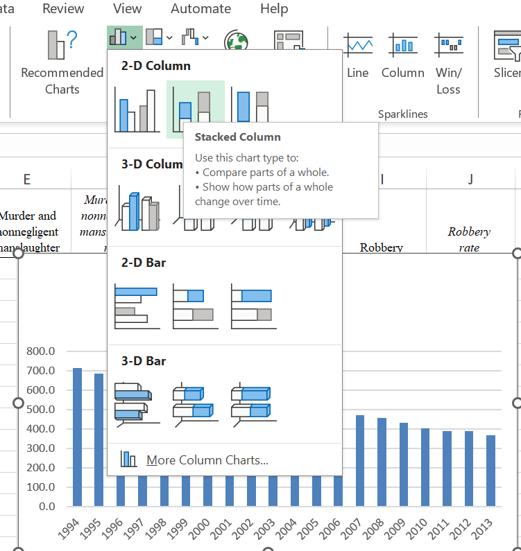


So that will create this column chart: 


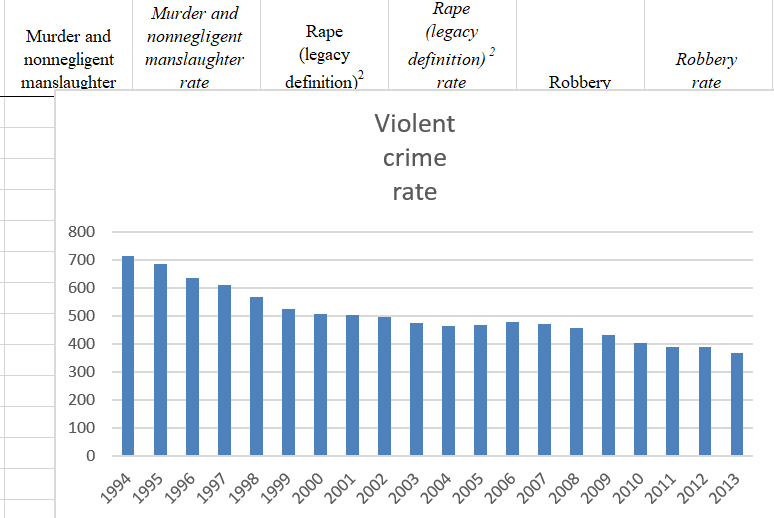


Now, just as we did with the line charts, just right-click anywhere on the chart area and again select "Select Data...". 

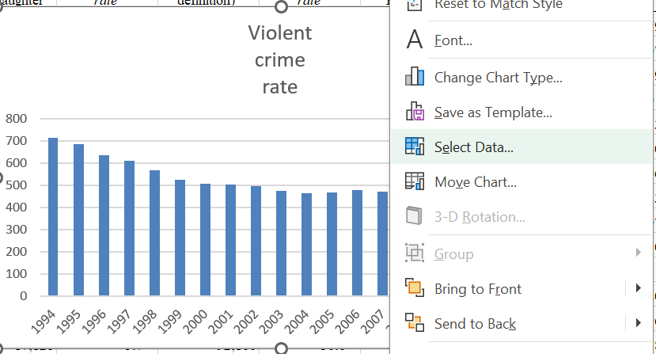


And again, this will bring up a popup. Here, once again, you can add variables with the "Add" button: 


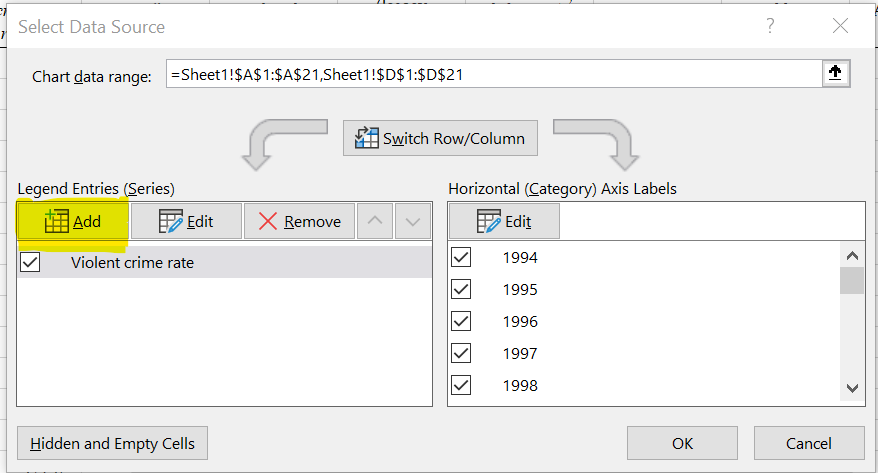


Once you click on the "Add" button, the fields for "Series name" and "Series values" should appear empty. Click in the text box next to "Series name", and then click on the column header (variable name) for the next variable. Select the "Robbery Rate" column header. Then click in the text box next to "Series values",  and then select the values for robbery rate: 


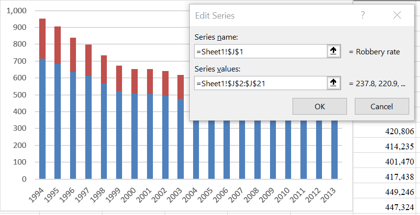


Then, repeat this for every variable you want to add. For every variable, click on "Add", then for "Series name", select the column header, and for "Series values", select the values for that variable. So in this case, again as we did for the line graphs, repeat this for "Aggravated Assault Rate" and again for "Burglary Rate": 


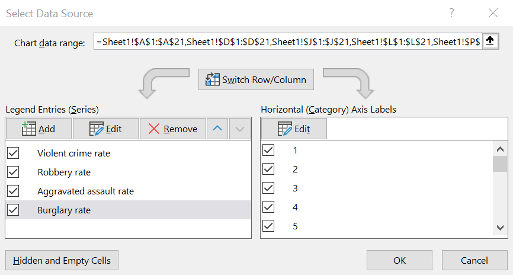


Then, finally, you should end up with a stacked bar chart of all these variables that allows you to compare the rate of each crime type between years but also allows you to compare a cumulative crime rate if you consider the crimes of Violent crimes, Robbery, Assault, and Burglary together: 


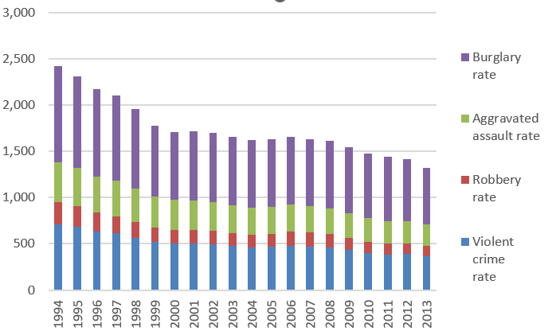


You can see that you can use data visualisation as a way of putting together many variables into one graph. Now, don't forget to make sure you're conscious about your colour choices! These are the default colours. Do we like them? Making no choice (i.e., sticking with the default) is still making a choice! I'll leave this up to you to see how you'd like to proceed...


## More guidance on chart design

If you would like some even further tips and tricks about data visualisation, read through this list on ["Dos and Don'ts of Charts and Graphs"](https://guides.library.duke.edu/datavis/topten) and have a look at some of [these examples](http://datajournalismhandbook.org/1.0/en/introduction_3.html) as well for some further inspiration. 


## Communicating results


We have been covering exploratory data analysis, where you take your data and produce visualisations. Still, sometimes, you can also complement your results by visualising your tables and other outputs. An example is conditional formatting, which we covered in week 3. 


The most important thing when communicating your results is that you know your audience. Know what they understand, what they don't, and what you can tell them in one graph. Your graph has to tell a story. Think about why you are making it. What is the message that you want to convey? What is the story this graph is telling? You need to be clear with this to ensure that your graph accomplishes its mission of telling an interesting story about your data. 

> You should look at your data. Graphs and charts let you explore and learn about the structure of the information you collect. Good data visualizations also make it easier to communicate your ideas and findings to other people. Beyond that, producing effective plots from your own data is the best way to develop a good eye for reading and understanding graphs—good and bad—made by others, whether presented in research articles, business slide decks, public policy advocacy, or media reports.

- [Kieran Healy](http://socviz.co/)


### Activity 8.9: Interpreting results


By becoming a maker of good graphs, you should also become literate about graphs. If you are interested in something like a role as a crime analyst, part of your interview process might include something like a numeracy test, which will test your ability to interpret trends and data from graphs (among other things). 


Here's an example: 


#### Question 1  {-}


Then the test question could be something like this: 


Pick all the true statements:

- 68% of observed lessons were graded 'Good' or 'Outstanding' in 2011.
- In 2011, the percentage of lessons that were graded 'Good' or 'Outstanding' was twice the percentage of lessons that were graded 'Good' or 'Outstanding' in 2007.
- The percentage of lessons graded 'Inadequate' was halved between 2007 and 2011.


So, which one of these do you think are true statements? 


OK, try again: 


#### Question 2  {-}


Pick all the true statements:

- The range of marks in Test A was greater than in Test B.
- The median mark in Test B was approximately 10 percentage points higher than the median mark in Test A.
- In Test B, one-quarter of the pupils achieved 75% or more. 


And again: 


#### Question 3  {-}


Pick all the true statements:

- Two-thirds of the pupils spent 15 minutes or less on planning.
- The range of time used for planning was 22 minutes.
- The pupil with the median planning time achieved a final mark of 54. 


And finally:


#### Question 4  {-}


Pick all the true statements:

- All the pupils completed the test within the maximum time allowed.
- The median time taken was 40 minutes.
- No pupils recorded a time less than 29 minutes. 


Alright. Make a note of all of your answers before reading the results ahead. 


#### Results {-}

OK, we have the answers for you now: 


- For question 1, the correct answers were Options A and C
- For question 2, the correct answers were Option B
- For question 3, the correct answers were Options A, B and C
- For question 4, the correct answers were Options A and B


So, how did you do? If you are unsure about any of the answers, ask us now!


## Summary

In sum, you should now be able to select a graph that represents your data in a meaningful way, that helps you describe your data as well as communicate your results to your audiences. You should be familiar with the following terms: 

- bar chart
- column chart
- line chart
- data-ink ratio
- stacked bar chart
- conditional formatting
- sequential, diverging, and qualitative scales


